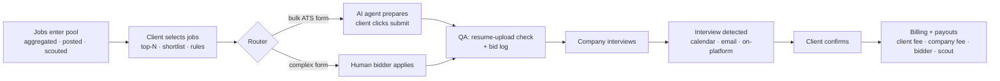

# 00 — Product Overview

## Purpose

A hiring platform built around one outcome: **a confirmed interview that the company actually wanted.** Every party is measured and paid on that event.

## The two services

| Service | Code name | Modes | What it does | Who pays |
|---|---|---|---|---|
| **Job Platform** (Service 1) | `platform` | Job Hunter, Company, Scout | Free job site. Companies post free. Scouts add hidden jobs. Job hunters search and apply. | Companies pay **per interview** on jobs they post directly. |
| **Connect** (Service 2) | `connect` | Client, Bidder (human), AI Agent | Job hunters (clients) hire human bidders or the AI agent to find, prepare and submit applications, then track every step. | Clients pay a plan and/or **per interview**. |

Both services share one **account system**, one **job pool**, one **interview tracking** system, one **wallet**, and one **trust layer**.

## Roles (modes)

One user account can hold several modes and switch between them in the header.

| Mode | Service | Description |
|---|---|---|
| Job Hunter | platform | Searches and applies to jobs for free. Can upgrade to Client. |
| Company | platform | Posts jobs for free, reviews applicants, schedules interviews, pays per interview. |
| Scout | platform | Submits jobs not listed on LinkedIn/Indeed. Earns when those jobs produce interviews, hires, and paying companies. |
| Client | connect | A job hunter who hires help. Assigns jobs, approves applications, confirms interviews, pays. |
| Bidder | connect | A verified human who applies to jobs for clients. Handles complex application forms. |
| AI Agent | connect | A platform-operated, clearly labeled agent that prepares bulk applications (Greenhouse/Ashby-style ATS). The **job hunter clicks submit**. |
| Admin | internal | Staff: moderation, fraud, disputes, payouts, configuration. |

## Core loop

## Principles (non-negotiable)

1. **The interview is the currency.** Access is free; outcomes are paid. Spam is unprofitable because bad applications never become interviews.
2. **Verify at the point of value.** Identity checks happen right before someone can earn, spend, or be interviewed.
3. **No fabrication.** Bidders and the agent may tailor wording and ordering but never invent experience, credentials, or employers. Resume changes need the candidate's approval.
4. **No proxy interviews.** Only the verified candidate attends interviews. Enforced by a face check at interview start (on-platform interviews).
5. **Human consent on every submission.** For AI-prepared applications, the candidate clicks submit. Every application has an audit trail.
6. **Employer control.** Companies can cap or refuse assisted applications per job; assisted applications are labeled.
7. **Fit over volume.** Quotas, fit thresholds, and company feedback limit volume. Quality earns capacity.
8. **Fairness between human bidders and the AI agent.** Same ranking rules, same metrics, no privileged access to jobs.

## North-star metric

**Confirmed interviews per 100 applications.** Secondary: confirmed interviews per client per week, company "not relevant" rate, client 3-month retention.

## Out of scope (for now)

- Live interview assistance of any kind (answer feeding, real-time copilots). Explicitly banned; conflicts with principle 4.
- Scraping sites whose terms prohibit it. Aggregation must use permitted feeds, ATS partner programs, career pages, and scout-submitted official links.
- Automated submission that bypasses CAPTCHAs or site bot protections.
