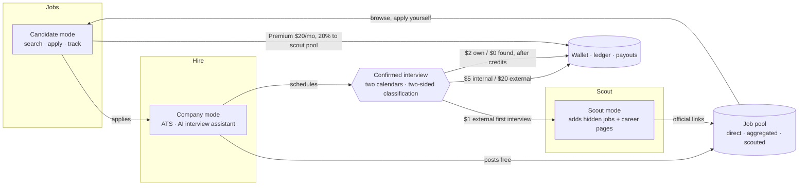
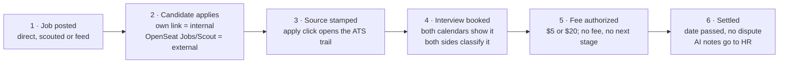

# 00 — Product Overview

## Purpose

OpenSeat is a hiring platform with one currency: **the interview.** Job seekers pay for interviews, not tools. Companies pay for interviews, not job posts or ATS seats. Scouts earn on interviews and usage, not volume. Spam isn't blocked by a price wall; it simply never earns.

## Three products, one account

| Product   | For                         | What it does                                                                                                                                                 | Who pays                                                                            | Status                  |
| --------- | --------------------------- | ------------------------------------------------------------------------------------------------------------------------------------------------------------ | ----------------------------------------------------------------------------------- | ----------------------- |
| **Jobs**  | Job seekers and companies   | Free job search, resumes and application tracking. Companies post for free. **Premium** unlocks hidden jobs found by scouts.                                 | Seekers: Premium $20/mo (optional); $2 per own-applicant interview after credits    | Live                    |
| **Hire**  | Companies that hire         | An ATS for the whole hiring process (career page, pipeline, stages, scorecards, offers) plus an **AI interview assistant** (transcript, analysis, HR notes). | Companies: **$5** per own-applicant interview, **$20** per OpenSeat-found interview | Launches month 3        |
| **Scout** | People who find hidden jobs | Scouts add jobs and whole career pages that aren't on the big boards. They earn a share of Premium revenue and $1 per external first interview.              | Nobody; scouts are paid on results                                                  | Built; opens months 4–6 |

All three share one login, calendar connection, identity checks, interview tracking, wallet and payouts, and one set of fraud and trust rules.

> **Connect is retired.** The earlier "Connect" service (human bidders and an AI agent applying on a job hunter's behalf) is no longer part of the product. Applications on OpenSeat are made by the candidate personally; bots, auto-apply tools and apply-for-you services are banned. See [ADR 0002](ADRs/0002-interview-currency-and-no-bot-applications.md) and [22-no-bot-applications.md](22-no-bot-applications.md).

## Modes (roles)

An account holds one role, chosen at signup (see [10-identity-and-accounts.md](10-identity-and-accounts.md)).

| Mode                                   | Product    | Description                                                                                                                                    |
| -------------------------------------- | ---------- | ---------------------------------------------------------------------------------------------------------------------------------------------- |
| **Candidate** (role code `job_hunter`) | Jobs       | Searches and applies to jobs **personally**, tracks applications and interviews, connects a calendar, optionally buys Premium.                 |
| **Company** (role code `recruiter`)    | Jobs, Hire | Posts jobs and a career page for free, runs the hiring pipeline in the ATS, schedules interviews, gets AI interview notes, pays per interview. |
| **Scout**                              | Scout      | Submits hidden jobs and career pages with official links. Earns from the Premium pool, external first interviews, and company conversions.     |
| Admin                                  | internal   | Staff: moderation, fraud, disputes, payouts, configuration.                                                                                    |

## Core loop: one interview, one record, one fee

## The pricing rule: who brought the candidate sets the price

|                 | **Internal** — applied via the company's own OpenSeat link or career page | **External** — found the job via OpenSeat Jobs or Scout    |
| --------------- | ------------------------------------------------------------------------- | ---------------------------------------------------------- |
| Company pays    | **$5** per interview (covers ATS, calendar, AI assistant)                 | **$20** per interview (we did the sourcing)                |
| Job seeker pays | **$2** per interview, after 3–5 free credits a month                      | **$0** (OpenSeat found the job)                            |
| Scout earns     | —                                                                         | **$1** on the candidate's first interview on a scouted job |

- Fees are **per candidate, per job, per interview**. The first three interviews are billed; **from the 4th interview for the same candidate and job, nobody pays** (both sides).
- Companies get no free credits; they pay from the first interview. Only job seekers get free credits.
- **Registered companies only.** An unregistered company owes nothing; the record starts once it registers.
- Fees settle after the interview date passes with no dispute.

Full detail: [50-pricing-and-revenue.md](50-pricing-and-revenue.md).

## Why the record holds

1. **Two calendars are the witness.** Every user connects Google or Outlook. An interview shows up on both the candidate's and the interviewer's calendars, even if booked outside OpenSeat.
2. **Both sides classify it.** Once a company is registered, the candidate and the company each mark every interview as internal or external.
3. **Their incentives collide.** The company wants "internal" ($5, not $20). The seeker wants "external" ($0, not $2). Neither can misreport without the other objecting, so honest answers agree.
4. **The log breaks ties.** The apply click stamps the source at first touch. If answers differ, the log decides; repeat mismatches are flagged.
5. **No fee, no next stage.** An unpaid interview locks the candidate's next stage in the ATS, so skipping the fee means giving up the tool.

See [30-interview-tracking.md](30-interview-tracking.md).

## Principles (non-negotiable)

1. **The interview is the currency.** Access is free; outcomes are paid. No side pays for volume; every payment is tied to an interview or a subscription.
2. **Humans apply, not bots.** Every application is made by the verified candidate in person. Auto-apply bots, AI agents, browser automation and apply-for-you services are banned from applying on OpenSeat ([22](22-no-bot-applications.md)).
3. **Verify at the point of value.** Identity checks happen right before someone can earn, pay, or be interviewed.
4. **Two-sided confirmation.** Money moves only on an interview confirmed by both calendars and classified by both sides.
5. **No live interview assistance for candidates.** The AI interview assistant serves the company's HR (notes after the fact); nothing feeds answers to candidates.
6. **Fair reports.** Objective reason codes, appeals, no public negative scores on job seekers.
7. **Scouts are paid on usage and interviews, never per submission.**

## North-star metric

**Confirmed interviews per month**, split internal vs external. Secondary: confirmed interviews per 100 applications, paying companies, Premium seekers, classification agreement rate. See [80-metrics-and-analytics.md](80-metrics-and-analytics.md).

## Market context (from the September 2026 investor deck)

- Applications are free; interviews are scarce: ~42 applications to land one interview; US average cost per hire **$5,475** (SHRM 2025).
- AI floods every inbox: ~11,000 applications a minute on LinkedIn, up 45% in a year. Raw volume is worthless to companies; a verified interview is not.
- Incumbents charge for access (clicks, slots, seats, ATS contracts) whether or not an interview happens. OpenSeat charges **only on interviews**: $85–$170 for a whole hiring round in the base model, ATS and AI assistant included.

## Out of scope

- Applying on a candidate's behalf by any person, bot or agent (the retired Connect model).
- Live interview assistance of any kind (answer feeding, real-time copilots).
- Scraping sites whose terms prohibit it. Aggregation uses permitted feeds, ATS public job feeds, scout-added career pages and direct posts.
- Automated submission that bypasses CAPTCHAs or site bot protections.
