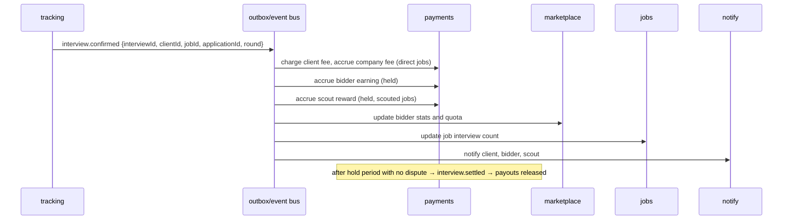

# 02 — System Architecture

## Goals

- Two user-facing services (`platform`, `connect`) that deploy independently, so a failure in Connect cannot take down the revenue-generating job site.
- Shared domain services (identity, jobs, tracking, payments, trust) owned in one place.
- Event-driven side effects: one business event ("interview confirmed") triggers billing, payouts, rewards, and notifications independently.
- Money and identity data isolated with stricter access than everything else.

## Recommended stack (default for new code)

Adapt to the existing job site's stack where it already exists. If there is no strong reason otherwise, use:

| Layer | Choice | Notes |
|---|---|---|
| Language | TypeScript (Node 22) for web + API; Python 3.12 allowed for AI agent workers | Shared types via `packages/types` |
| Monorepo | pnpm workspaces + Turborepo | Build/test only what changed |
| Web apps | Next.js (App Router), React, Tailwind | SSR for SEO pages on the job platform |
| API | NestJS or Fastify, REST + OpenAPI 3.1 | See [60-api-conventions.md](60-api-conventions.md) |
| Database | PostgreSQL 16 | One logical DB per service (separate schemas at minimum) |
| ORM / migrations | Drizzle or Prisma | Migrations are code-reviewed, forward-only |
| Cache / rate limits | Redis | Sessions, quotas, idempotency keys |
| Queues | BullMQ on Redis | Background jobs, retries, schedules |
| Events | Transactional outbox in Postgres → publisher → BullMQ topics (upgrade to NATS/Kafka at scale) | At-least-once; consumers are idempotent |
| Search | OpenSearch or Meilisearch | Job search, facets, geo |
| Object storage | S3-compatible | Resumes, evidence, exports; server-side encryption |
| Browser automation | Playwright (headless Chromium) in isolated worker pool | AI agent only |
| LLM | Provider-agnostic interface | Tailoring, classification, parsing |
| Payments | Stripe (Billing, Connect for payouts) | Ledger is ours; Stripe is the rail |
| Identity verification | Usage-based vendor (Stripe Identity / Persona / Sumsub) | Store vendor reference, not raw documents |
| Email | Transactional provider with inbound parse (SES / Postmark) | Also used for interview email forwarding |
| Calendar | Google Calendar API, Microsoft Graph | Read-only scopes |
| Auth | OIDC-based (self-hosted or managed), passkeys + email OTP | Short-lived JWT access tokens |
| Observability | OpenTelemetry, structured JSON logs, Sentry | Trace ID on every request and job |
| Infra | Containers on Kubernetes or ECS; Terraform | Separate prod/staging/dev accounts |

## Repository layout

```
repo/
├── apps/
│   ├── platform-web/        # Service 1 UI: job hunter, company, scout modes (SSR, SEO)
│   ├── connect-web/         # Service 2 UI: client and bidder modes
│   ├── admin-web/           # Internal admin console
│   ├── extension/           # Browser extension: submit handoff + application capture
│   └── api-gateway/         # Public REST gateway: auth, routing, rate limits
├── services/
│   ├── identity/            # accounts, modes, verification, risk, delegation
│   ├── jobs/                # job pool, ingestion, scout submissions, quality checks, search indexing
│   ├── matching/            # fit scoring, routing (bulk vs complex)
│   ├── marketplace/         # assignments, applications, bidder queue, QA
│   ├── agent/               # AI agent orchestrator + workers (may be Python)
│   ├── tracking/            # calendar/email ingestion, interview detection, scheduling
│   ├── payments/            # ledger, wallet, escrow, billing, payouts (restricted)
│   ├── trust/               # reports, fraud rules, moderation, link analysis
│   └── notify/              # email, push, in-app notifications, messaging
├── packages/
│   ├── types/               # shared domain types and event schemas (zod)
│   ├── ui/                  # design system components
│   ├── sdk/                 # typed API client generated from OpenAPI
│   └── config/              # lint, tsconfig, env schema
├── infra/                   # Terraform, Helm/manifests, CI pipelines
└── docs/                    # this folder
```

### Boundary rules

- A service **owns its tables**. Other services never read them directly; they call the owning service's API or consume its events.
- Apps talk only to `api-gateway`. Services talk to each other over internal HTTP or events.
- `payments` and `identity` have restricted code ownership (CODEOWNERS) and separate database credentials.
- Enforce import boundaries with lint rules (e.g. `eslint-plugin-boundaries`).

## Service responsibilities

| Service | Owns | Emits (examples) | Consumes (examples) |
|---|---|---|---|
| identity | users, modes, sessions, verification, risk scores, delegation agreements | `user.created`, `user.verified`, `risk.changed` | `report.upheld` |
| jobs | jobs, companies, scout submissions, claims | `job.published`, `job.expired`, `scout.submission.approved`, `company.claimed` | `interview.confirmed` (job stats) |
| matching | fit scores, routing decisions | `fit.computed` | `job.published`, `client.preferences.updated` |
| marketplace | assignments, applications, bid logs, QA results, bidder profiles, quotas | `assignment.created`, `application.submitted`, `application.qa_failed` | `interview.confirmed`, `company.feedback.not_relevant` |
| agent | agent runs, prepared payloads, run logs | `agent.application.prepared`, `agent.run.failed` | `assignment.created` |
| tracking | calendar/email connections, interview events, confirmations, schedules | `interview.detected`, `interview.confirmed`, `interview.disputed` | `application.submitted` |
| payments | ledger, wallets, escrow, invoices, payouts, prices | `charge.succeeded`, `payout.released`, `invoice.issued` | `interview.confirmed`, `interview.settled`, `dispute.resolved` |
| trust | reports, fraud flags, moderation cases, link graph | `report.upheld`, `fraud.flagged`, `account.suspended` | nearly everything (for rules) |
| notify | notification preferences, message threads, delivery logs | `notification.sent` | nearly everything |

## Key flows

### Interview confirmed → money moves



## Non-functional requirements

| Area | Requirement |
|---|---|
| Availability | Platform web and job search 99.9%. Connect 99.5%. Payments writes 99.9%. |
| Latency | Job search p95 < 400 ms. Page TTFB p95 < 800 ms (SSR). API p95 < 300 ms for reads. |
| Scale (year 1 target) | 1M jobs in pool, 200k monthly active job hunters, 20k clients, 5k bidders, 500k applications/month. |
| Idempotency | All POSTs that create money or applications require `Idempotency-Key`. Event consumers dedupe by event ID. |
| Data durability | Point-in-time recovery for Postgres (≥ 14 days). Ledger is append-only. |
| Security | See [90-compliance-privacy-security.md](90-compliance-privacy-security.md). |
| Accessibility | WCAG 2.2 AA for all user-facing pages. |
| i18n | All user-facing strings externalized; currency and time zone per user. |

## Environments

`dev` (per-developer, seeded data), `staging` (production-like, fake payments, test IDV), `prod`. Feature flags control rollout of every new mode or pricing change.
