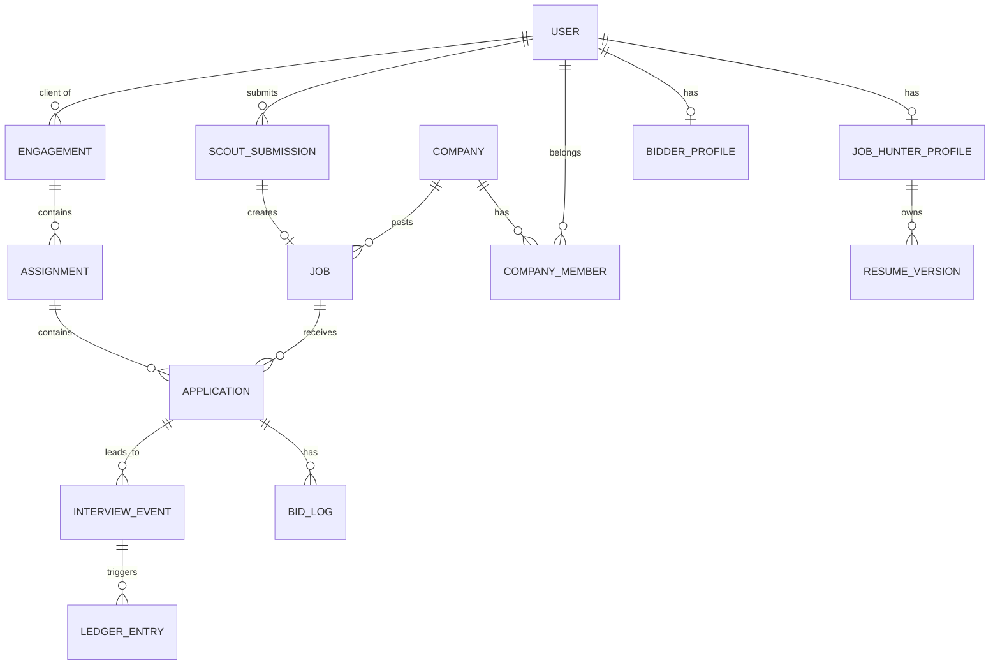
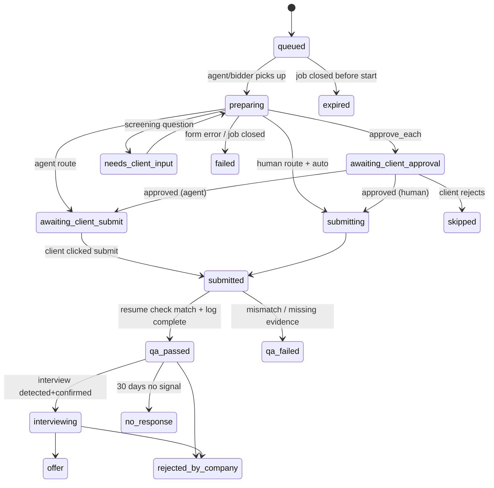
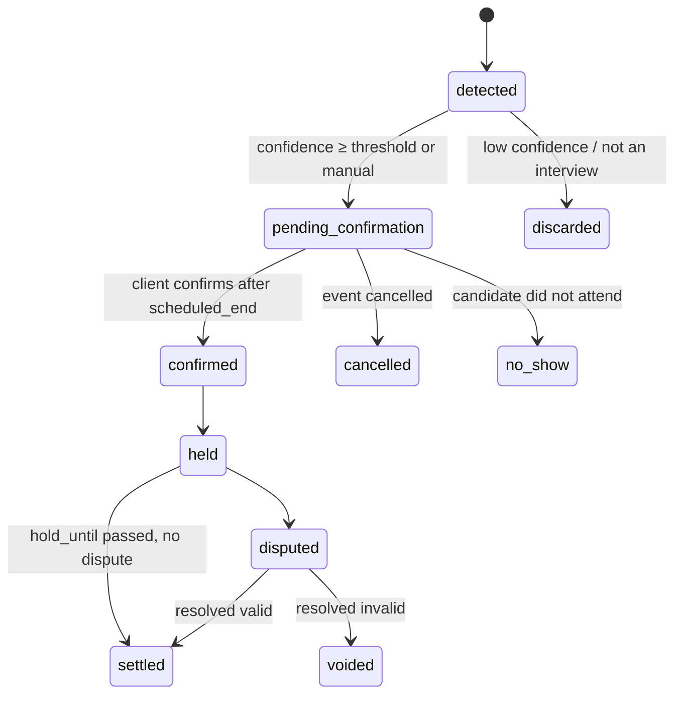

# 03 — Data Model

Logical model grouped by owning service. Column types are PostgreSQL. Every table also has `created_at timestamptz not null default now()` and `updated_at timestamptz not null` unless noted. Soft deletes use `deleted_at`. PII columns marked 🔒 are encrypted at the application layer (see [90-compliance-privacy-security.md](90-compliance-privacy-security.md)).

## identity

### users

| column            | type                                         | notes                              |
| ----------------- | -------------------------------------------- | ---------------------------------- |
| id                | uuid pk                                      | UUIDv7                             |
| email             | citext unique                                | verified flag separate             |
| email_verified_at | timestamptz                                  |                                    |
| phone 🔒          | text                                         | E.164                              |
| phone_verified_at | timestamptz                                  |                                    |
| display_name      | text                                         |                                    |
| time_zone         | text                                         | IANA                               |
| locale            | text                                         |                                    |
| status            | enum `active, restricted, suspended, closed` |                                    |
| verification_tier | smallint                                     | 0–3, see identity doc              |
| risk_score        | smallint                                     | 0–100, cached from risk engine     |
| role              | enum `job_hunter, recruiter, scout`          | One per account. Chosen at signup. |

### role data

The login row stays in `users`. Each role keeps its own fields, and an account has only one of them:

| Role       | Record                             | Holds                                                            |
| ---------- | ---------------------------------- | ---------------------------------------------------------------- |
| Job hunter | `job_hunter_profiles`              | Headline, target roles, salary floor, skills, work authorization |
| Recruiter  | `company_members` plus `companies` | The person (`user_id`, role) and the company page they belong to |
| Scout      | `scout_profiles`                   | Level, terms, legal name, country, tax last four, payout method  |

### identity_verifications

`id`, `user_id`, `vendor`, `vendor_ref`, `type enum(id_document, liveness, business, re_verification)`, `status enum(pending, passed, failed, expired)`, `face_template_ref 🔒` (vendor reference only), `checked_at`, `expires_at`.

### devices

`id`, `user_id`, `fingerprint_hash`, `first_seen_at`, `last_seen_at`, `ip_last`, `asn`, `is_vpn bool`, `risk_flags jsonb`.

### delegation_agreements

Records that a client authorized a specific bidder (or the agent) to act for them.
`id`, `client_user_id`, `actor_type enum(bidder, agent)`, `actor_user_id nullable`, `engagement_id`, `scope jsonb` (allowed actions), `signed_at`, `revoked_at`, `document_version`.

## jobs

### companies

`id`, `name`, `slug unique`, `primary_domain`, `domains text[]`, `ats_type enum(greenhouse, lever, ashby, workday, smartrecruiters, icims, custom, unknown)`, `ats_board_token`, `status enum(unclaimed, claimed, verified, suspended)`, `claimed_by_company_account_id`, `registry_ref`, `logo_url`, `size_band`, `industry`.

### company_members

`company_id`, `user_id`, `role enum(owner, admin, recruiter, viewer)`, `status`.

### jobs

| column                                       | type                                                                   | notes                                                  |
| -------------------------------------------- | ---------------------------------------------------------------------- | ------------------------------------------------------ |
| id                                           | uuid pk                                                                |                                                        |
| company_id                                   | uuid fk                                                                |                                                        |
| source                                       | enum `direct, aggregated, scouted`                                     | Drives company billing                                 |
| source_ref                                   | text                                                                   | feed id, scout submission id, or null                  |
| title                                        | text                                                                   |                                                        |
| normalized_title                             | text                                                                   | For dedupe/matching                                    |
| seniority                                    | enum `intern, entry, mid, senior, lead, executive`                     |                                                        |
| employment_type                              | enum `full_time, part_time, contract, temporary, internship`           |                                                        |
| location_type                                | enum `onsite, hybrid, remote`                                          |                                                        |
| locations                                    | jsonb                                                                  | `[{city, region, country, lat, lng}]`                  |
| salary_min_cents / salary_max_cents          | bigint                                                                 | nullable                                               |
| salary_currency                              | char(3)                                                                |                                                        |
| summary                                      | text                                                                   | **Our own structured summary**, not copied description |
| description                                  | text                                                                   | **Required.** Original posting, before AI analysis     |
| requirements                                 | jsonb                                                                  | skills, years, certifications                          |
| official_apply_url                           | text                                                                   | Required                                               |
| apply_form_complexity                        | enum `bulk, complex, unknown`                                          | From matching/router                                   |
| visa_sponsorship                             | enum `yes, no, unknown`                                                |                                                        |
| assisted_applications_policy                 | enum `accept, cap, direct_only`                                        | Direct jobs only; default `accept`                     |
| assisted_daily_cap                           | int                                                                    | When policy = cap                                      |
| status                                       | enum `draft, pending_review, active, paused, expired, closed, removed` |                                                        |
| posted_at, expires_at, last_verified_open_at | timestamptz                                                            |                                                        |
| dedupe_key                                   | text                                                                   | hash(company, normalized title, location, url)         |
| quality_score                                | smallint                                                               | 0–100                                                  |

Indexes: `(status, posted_at desc)`, `(company_id, status)`, `dedupe_key unique where status in active states`, GIN on `requirements`.

### scout_submissions

`id`, `scout_user_id`, `job_id nullable`, `submitted_url`, `company_name`, `title`, `location_text`, `summary`, `status enum(submitted, auto_checking, needs_review, approved, rejected, duplicate)`, `rejection_reason`, `auto_check_results jsonb`, `reviewed_by`, `reviewed_at`.

### company_claims

`id`, `company_id`, `requested_by_user_id`, `method enum(domain_email, dns_txt, manual)`, `status`, `verified_at`.

## matching

### fit_scores

`client_user_id`, `job_id`, `score smallint`, `reasons jsonb`, `model_version`, `computed_at`. PK `(client_user_id, job_id)`.

### routing_decisions

`job_id`, `route enum(agent, human)`, `reason`, `ats_type`, `form_signature_hash`, `decided_at`, `overridden_by`.

## marketplace

### job_hunter_profiles

`user_id pk`, `headline`, `target_roles text[]`, `locations jsonb`, `remote_pref`, `salary_floor_cents`, `salary_currency`, `work_authorization jsonb 🔒`, `do_not_apply_companies uuid[]`, `preferences jsonb`.

### resume_versions

`id`, `owner_user_id`, `label`, `file_key` (S3), `file_sha256`, `parsed jsonb`, `is_default bool`, `approved_by_owner_at`, `derived_from_id nullable`, `created_by_user_id` (owner, bidder, or agent).

### bidder_profiles

`user_id pk`, `level enum(new, rising, top, elite)`, `specialties text[]`, `languages text[]`, `regions text[]`, `bio`, `compensation_model enum(piece_rate, marketplace)`, `piece_rate_cents`, `packages jsonb`, `daily_quota`, `status enum(onboarding, active, paused, suspended)`, `skills_test_score`, stats columns (`apps_30d`, `interviews_30d`, `interview_rate_30d numeric`, `not_relevant_rate_30d numeric`, `retention_rate numeric`).

### engagements

A contract between a client and a provider (bidder or agent).
`id`, `client_user_id`, `provider_type enum(bidder, agent)`, `bidder_user_id nullable`, `plan_code`, `status enum(pending_payment, active, paused, ended, disputed)`, `approval_mode enum(approve_each, auto_within_rules)`, `rules jsonb` (roles, locations, salary floor, min fit, exclusions, weekly target), `starts_at`, `ends_at`, `delegation_agreement_id`.

### assignments

`id`, `engagement_id`, `created_by_user_id`, `selection_method enum(manual, top_n, shortlist, rules)`, `target_count`, `deadline_at`, `resume_version_id`, `allow_tailoring bool`, `notes`, `status enum(open, in_progress, completed, cancelled)`.

### applications

| column                  | type                                         | notes                               |
| ----------------------- | -------------------------------------------- | ----------------------------------- |
| id                      | uuid pk                                      |                                     |
| assignment_id           | uuid fk                                      |                                     |
| client_user_id          | uuid                                         | denormalized for queries            |
| job_id                  | uuid fk                                      |                                     |
| actor_type              | enum `bidder, agent, self`                   |                                     |
| actor_user_id           | uuid nullable                                |                                     |
| route                   | enum `agent, human`                          |                                     |
| status                  | enum (see state machine)                     |                                     |
| resume_version_id       | uuid                                         | assigned                            |
| uploaded_resume_sha256  | text                                         | captured at submission              |
| resume_check            | enum `pending, match, mismatch, unavailable` |                                     |
| client_note             | text                                         |                                     |
| screening_questions     | jsonb                                        | Q&A, with `answered_by`             |
| submitted_at            | timestamptz                                  |                                     |
| submission_evidence_key | text                                         | screenshot / confirmation email ref |
| assisted_label          | bool                                         | true unless `self`                  |
| fit_score_at_assign     | smallint                                     |                                     |
| company_feedback        | enum `none, not_relevant, good_fit`          |                                     |
| failure_reason          | text                                         |                                     |

Unique: `(client_user_id, job_id)` — a client never applies twice to the same job.

**Application state machine**

### bid_logs

Append-only record of work on an application.
`id`, `application_id`, `actor_user_id`, `action enum(opened, filled, uploaded_resume, answered_question, submitted, captured_confirmation, note)`, `payload jsonb`, `occurred_at`.

### qa_reviews

`id`, `application_id`, `reviewer_type enum(auto, human)`, `result enum(pass, fail)`, `reasons text[]`, `reviewed_at`.

### quotas

`subject_type enum(bidder, agent)`, `subject_id`, `client_user_id nullable`, `period_date date`, `limit int`, `used int`. PK `(subject_type, subject_id, client_user_id, period_date)`.

## agent

### agent_runs

`id`, `assignment_id`, `started_at`, `finished_at`, `status enum(running, completed, failed, cancelled)`, `jobs_attempted`, `jobs_prepared`, `jobs_failed`, `compute_cost_cents`, `worker_id`, `model_versions jsonb`.

### agent_prepared_payloads

`id`, `application_id`, `ats_type`, `form_fields jsonb` (field → value), `attachments jsonb` (S3 keys), `tailoring_diff jsonb`, `fabrication_check enum(pass, flagged)`, `expires_at`, `handoff_status enum(ready, opened, submitted, abandoned, expired)`.

## tracking

### calendar_connections / email_connections

`id`, `user_id`, `provider enum(google, microsoft, forward)`, `scopes text[]`, `token_ref 🔒` (KMS-encrypted), `status`, `last_sync_at`, `webhook_channel_id`, `forward_address` (email forward only).

### interview_events

| column                          | type                                        | notes                                      |
| ------------------------------- | ------------------------------------------- | ------------------------------------------ |
| id                              | uuid pk                                     |                                            |
| candidate_user_id               | uuid                                        |                                            |
| job_id                          | uuid nullable                               | resolved match                             |
| company_id                      | uuid nullable                               |                                            |
| application_id                  | uuid nullable                               |                                            |
| round_number                    | smallint                                    | 1 = first interview for this candidate+job |
| source                          | enum `calendar, email, on_platform, manual` |                                            |
| source_ref                      | text                                        | provider event/message id (dedupe)         |
| scheduled_start / scheduled_end | timestamptz                                 |                                            |
| organizer_domain                | text                                        |                                            |
| match_confidence                | smallint                                    | 0–100                                      |
| status                          | enum (see state machine)                    |                                            |
| confirmed_at, confirmed_by      |                                             |                                            |
| hold_until                      | timestamptz                                 |                                            |
| dispute_id                      | uuid nullable                               |                                            |

**Interview state machine**

### interview_schedules (on-platform, direct jobs)

`id`, `company_id`, `job_id`, `candidate_user_id`, `slots jsonb`, `selected_slot`, `video_room_ref`, `face_check_status enum(pending, passed, failed, skipped)`, `status`.

## payments

See [31-payments-wallet-escrow.md](31-payments-wallet-escrow.md) for rules.

### ledger_accounts

`id`, `owner_type enum(user, company, platform, escrow, stripe_clearing, tax)`, `owner_id`, `currency`, `kind enum(wallet, receivable, payable, revenue, escrow, fees)`.

### ledger_transactions / ledger_entries

Double-entry. `ledger_transactions(id, type, reference_type, reference_id, idempotency_key unique, occurred_at)`. `ledger_entries(id, transaction_id, account_id, amount_cents bigint, direction enum(debit, credit))`. Sum of debits = sum of credits per transaction (enforced by constraint trigger). **Never updated or deleted.**

### price_books

`id`, `code`, `applies_to enum(company_interview, client_interview, plan, scout_reward, bidder_piece_rate)`, `rules jsonb` (by seniority, round, region), `currency`, `effective_from`, `effective_to`.

### invoices, charges, payouts

Standard: `invoices(id, payer_type, payer_id, period, status, total_cents)`, `charges(id, invoice_id, stripe_ref, status)`, `payouts(id, payee_user_id, amount_cents, status enum(pending, held, released, paid, failed, reversed), stripe_transfer_ref, release_at)`.

## trust

`reports(id, reporter_user_id, subject_type, subject_id, reason_code, details, status, reporter_weight, resolution)`, `fraud_flags(id, subject_type, subject_id, rule_code, score, evidence jsonb, status)`, `moderation_cases(id, queue, subject, assigned_to, status, decision, decided_at)`, `link_edges(a_type, a_id, b_type, b_id, via enum(device, ip, payout_account, payment_method, phone), first_seen_at)`.

## notify

`notifications(id, user_id, type, payload, channel, status, read_at)`, `message_threads(id, context_type, context_id)`, `messages(id, thread_id, sender_user_id, body, attachments, created_at)`, `notification_preferences(user_id, type, channels)`.

## Audit

`audit_log(id, actor_user_id, actor_type, action, subject_type, subject_id, before jsonb, after jsonb, ip, user_agent, occurred_at)` — append-only, written for every admin action, money movement, verification decision, and permission change.
