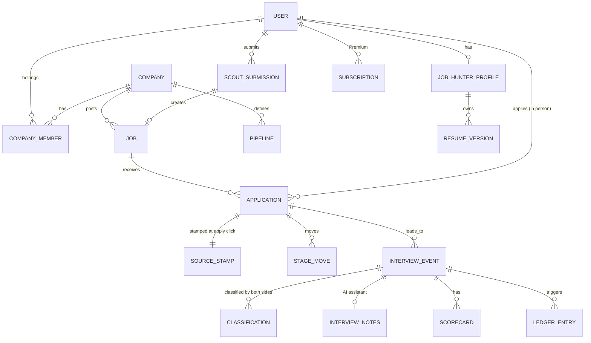
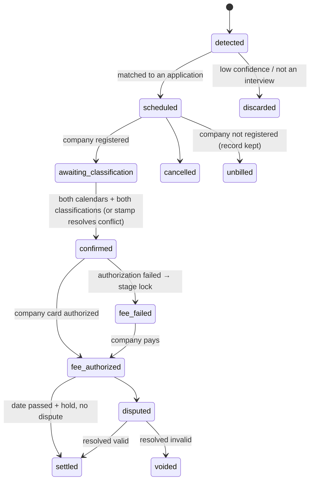

# 03 — Data Model

Logical model grouped by owning service. Column types are PostgreSQL. Every table also has `created_at timestamptz not null default now()` and `updated_at timestamptz not null` unless noted. Soft deletes use `deleted_at`. PII columns marked 🔒 are encrypted at the application layer (see [90-compliance-privacy-security.md](90-compliance-privacy-security.md)).

## identity

### users

| column            | type                                         | notes                                                             |
| ----------------- | -------------------------------------------- | ----------------------------------------------------------------- |
| id                | uuid pk                                      | UUIDv7                                                            |
| email             | citext unique                                | verified flag separate                                            |
| email_verified_at | timestamptz                                  |                                                                   |
| phone 🔒          | text                                         | E.164                                                             |
| phone_verified_at | timestamptz                                  |                                                                   |
| display_name      | text                                         |                                                                   |
| time_zone         | text                                         | IANA                                                              |
| locale            | text                                         |                                                                   |
| status            | enum `active, restricted, suspended, closed` |                                                                   |
| verification_tier | smallint                                     | 0–3, see identity doc                                             |
| risk_score        | smallint                                     | 0–100, cached from risk engine                                    |
| role              | enum `job_hunter, recruiter, scout`          | One per account. Chosen at signup. `job_hunter` = Candidate mode. |

### role data

The login row stays in `users`. Each role keeps its own fields, and an account has only one of them:

| Role      | Record                             | Holds                                                            |
| --------- | ---------------------------------- | ---------------------------------------------------------------- |
| Candidate | `job_hunter_profiles`              | Headline, target roles, salary floor, skills, work authorization |
| Recruiter | `company_members` plus `companies` | The person (`user_id`, role) and the company page they belong to |
| Scout     | `scout_profiles`                   | Level, terms, legal name, country, tax last four, payout method  |

### identity_verifications

`id`, `user_id`, `vendor`, `vendor_ref`, `type enum(id_document, liveness, business, re_verification)`, `status enum(pending, passed, failed, expired)`, `face_template_ref 🔒` (vendor reference only), `checked_at`, `expires_at`.

### devices

`id`, `user_id`, `fingerprint_hash`, `first_seen_at`, `last_seen_at`, `ip_last`, `asn`, `is_vpn bool`, `automation_signals jsonb` (headless, webdriver, synthetic input, known auto-apply extension), `risk_flags jsonb`.

### automation_detections

`id`, `user_id`, `device_id`, `surface enum(apply, search, signup, scout_web)`, `signals jsonb`, `score smallint`, `action enum(challenge, block_apply, restrict, case)`, `occurred_at`. See [22-no-bot-applications.md](22-no-bot-applications.md).

## jobs

### companies

`id`, `name`, `slug unique`, `primary_domain`, `domains text[]`, `ats_type enum(greenhouse, lever, ashby, workday, smartrecruiters, icims, custom, unknown)`, `ats_board_token`, `status enum(unclaimed, claimed, verified, suspended)`, `registered_at timestamptz nullable` (terms accepted + payment method; interview fees accrue only after this), `claimed_by_company_account_id`, `scouted_by_user_id nullable` (for the conversion bonus), `registry_ref`, `logo_url`, `size_band`, `industry`, `career_page_slug`.

### company_members

`company_id`, `user_id`, `role enum(owner, admin, recruiter, viewer)`, `status`.

### jobs

| column                                       | type                                                                   | notes                                                   |
| -------------------------------------------- | ---------------------------------------------------------------------- | ------------------------------------------------------- |
| id                                           | uuid pk                                                                |                                                         |
| company_id                                   | uuid fk                                                                |                                                         |
| source                                       | enum `direct, aggregated, scouted`                                     | Where the job came from (not the fee; see source stamp) |
| source_ref                                   | text                                                                   | feed id, scout submission id, or null                   |
| title                                        | text                                                                   |                                                         |
| normalized_title                             | text                                                                   | For dedupe/matching                                     |
| seniority                                    | enum `intern, entry, mid, senior, lead, executive`                     |                                                         |
| employment_type                              | enum `full_time, part_time, contract, temporary, internship`           |                                                         |
| location_type                                | enum `onsite, hybrid, remote`                                          |                                                         |
| locations                                    | jsonb                                                                  | `[{city, region, country, lat, lng}]`                   |
| salary_min_cents / salary_max_cents          | bigint                                                                 | nullable                                                |
| salary_currency                              | char(3)                                                                |                                                         |
| summary                                      | text                                                                   | **Our own structured summary**, not copied description  |
| requirements                                 | jsonb                                                                  | skills, years, certifications                           |
| official_apply_url                           | text                                                                   | Required                                                |
| visa_sponsorship                             | enum `yes, no, unknown`                                                |                                                         |
| is_hidden                                    | bool                                                                   | Scouted and not on major boards; Premium-first          |
| hidden_ended_at                              | timestamptz                                                            | Set when the job appears publicly                       |
| owner_scout_user_id                          | uuid nullable                                                          | First approved scout; earns pool share and bonus        |
| pipeline_id                                  | uuid nullable                                                          | ATS pipeline (direct jobs of registered companies)      |
| status                                       | enum `draft, pending_review, active, paused, expired, closed, removed` |                                                         |
| posted_at, expires_at, last_verified_open_at | timestamptz                                                            |                                                         |
| dedupe_key                                   | text                                                                   | hash(company, normalized title, location, url)          |
| quality_score                                | smallint                                                               | 0–100                                                   |

Indexes: `(status, posted_at desc)`, `(company_id, status)`, `dedupe_key unique where status in active states`, GIN on `requirements`.

### scout_submissions

`id`, `scout_user_id`, `job_id nullable`, `submitted_url`, `company_name`, `title`, `location_text`, `summary`, `status enum(submitted, auto_checking, needs_review, approved, rejected, duplicate)`, `rejection_reason`, `auto_check_results jsonb`, `reviewed_by`, `reviewed_at`.

### company_claims

`id`, `company_id`, `requested_by_user_id`, `method enum(domain_email, dns_txt, manual)`, `status`, `verified_at`.

## matching

### fit_scores

`candidate_user_id`, `job_id`, `score smallint`, `reasons jsonb`, `model_version`, `computed_at`. PK `(candidate_user_id, job_id)`. Used for recommendations and applicant sorting only; never to apply automatically.

## ats

### job_hunter_profiles

`user_id pk`, `headline`, `target_roles text[]`, `locations jsonb`, `remote_pref`, `salary_floor_cents`, `salary_currency`, `work_authorization jsonb 🔒`, `preferences jsonb`.

### resume_versions

`id`, `owner_user_id`, `label`, `file_key` (S3), `file_sha256`, `parsed jsonb`, `is_default bool`. Created and edited by the owner only.

### applications

| column            | type                                                                        | notes                                                           |
| ----------------- | --------------------------------------------------------------------------- | --------------------------------------------------------------- |
| id                | uuid pk                                                                     |                                                                 |
| candidate_user_id | uuid                                                                        |                                                                 |
| job_id            | uuid fk                                                                     |                                                                 |
| company_id        | uuid fk                                                                     | denormalized                                                    |
| channel           | enum `company_link, career_page, openseat_jobs, scout_hidden, off_platform` | How the candidate reached the apply form                        |
| source            | enum `internal, external`                                                   | Copied from the source stamp; never edited                      |
| resume_version_id | uuid                                                                        |                                                                 |
| answers           | jsonb                                                                       | Screening questions                                             |
| stage_id          | uuid fk                                                                     | Current pipeline stage                                          |
| stage_locked      | bool                                                                        | True while an interview fee is unpaid ("no fee, no next stage") |
| status            | enum `applied, in_review, interviewing, offer, hired, rejected, withdrawn`  |                                                                 |
| human_attestation | jsonb                                                                       | Session id, device id, risk score, challenge result at submit   |
| submitted_at      | timestamptz                                                                 |                                                                 |

Unique: `(candidate_user_id, job_id)` — one application per candidate per job.

### source_stamps

Append-only first-touch record written on the apply click.
`id`, `application_id unique`, `candidate_user_id`, `job_id`, `company_id`, `source enum(internal, external)`, `channel`, `referrer_url`, `link_token` (company link or scout job id), `session_id`, `occurred_at`. **Never updated.** It is the tie-breaker for classification disputes ([30](30-interview-tracking.md)).

### pipelines / stages / stage_moves

`pipelines(id, company_id, name, is_default)`, `stages(id, pipeline_id, position, kind enum(applied, screen, interview, offer, hired, rejected), name)`, `stage_moves(id, application_id, from_stage_id, to_stage_id, moved_by_user_id, blocked_reason nullable, occurred_at)` — append-only.

### scorecards

`id`, `interview_event_id`, `interviewer_user_id`, `criteria jsonb` (criterion → rating, evidence), `recommendation enum(strong_no, no, yes, strong_yes)`, `ai_draft_id nullable`, `submitted_at`. Submitted by a human; AI drafts are suggestions.

### offers

`id`, `application_id`, `status enum(draft, sent, accepted, declined, withdrawn)`, `terms jsonb 🔒`, `sent_at`, `decided_at`.

## assistant

### interview_recordings / transcripts / interview_notes

`interview_recordings(id, interview_event_id, storage_key, consent jsonb` (who consented, when, jurisdiction rule applied)`, duration_s, deleted_at)`, `transcripts(id, recording_id, language, segments jsonb, model_version)`, `interview_notes(id, interview_event_id, summary, analysis jsonb, scorecard_draft jsonb, model_version, cost_cents, visible_to_candidate bool default false)`. See [21-hire-ai-interview-assistant.md](21-hire-ai-interview-assistant.md).

## tracking

### calendar_connections / email_connections

`id`, `user_id`, `provider enum(google, microsoft, forward)`, `scopes text[]`, `token_ref 🔒` (KMS-encrypted), `status`, `last_sync_at`, `webhook_channel_id`, `forward_address` (email forward only).

### interview_events

| column                          | type                                              | notes                                                       |
| ------------------------------- | ------------------------------------------------- | ----------------------------------------------------------- |
| id                              | uuid pk                                           |                                                             |
| candidate_user_id               | uuid                                              |                                                             |
| job_id                          | uuid nullable                                     | resolved match                                              |
| company_id                      | uuid nullable                                     |                                                             |
| application_id                  | uuid nullable                                     |                                                             |
| interview_number                | smallint                                          | 1 = first interview for this candidate+job; billable if ≤ 3 |
| source                          | enum `calendar, email, on_platform, manual`       | how it was detected                                         |
| source_refs                     | jsonb                                             | provider event ids from **each** side's calendar (dedupe)   |
| seen_on_candidate_calendar      | bool                                              |                                                             |
| seen_on_company_calendar        | bool                                              |                                                             |
| scheduled_start / scheduled_end | timestamptz                                       |                                                             |
| organizer_domain                | text                                              |                                                             |
| match_confidence                | smallint                                          | 0–100                                                       |
| candidate_classification        | enum `internal, external, not_interview` nullable |                                                             |
| company_classification          | enum `internal, external, not_interview` nullable |                                                             |
| resolved_classification         | enum `internal, external`                         | agreed answer, or the source stamp on conflict              |
| resolved_by                     | enum `agreement, source_stamp, moderator`         |                                                             |
| billable                        | bool                                              | registered company AND number ≤ 3 AND not voided            |
| status                          | enum (see state machine)                          |                                                             |
| confirmed_at                    | timestamptz                                       |                                                             |
| hold_until                      | timestamptz                                       | interview date + hold period                                |
| dispute_id                      | uuid nullable                                     |                                                             |

**Interview state machine**

### interview_schedules (on-platform)

`id`, `company_id`, `job_id`, `candidate_user_id`, `slots jsonb`, `selected_slot`, `video_room_ref`, `face_check_status enum(pending, passed, failed, skipped)`, `recording_consent jsonb`, `status`.

## payments

See [31-payments-wallet-escrow.md](31-payments-wallet-escrow.md) for rules.

### ledger_accounts

`id`, `owner_type enum(user, company, platform, stripe_clearing, tax)`, `owner_id`, `currency`, `kind enum(wallet, receivable, payable, revenue, cost, fees)`.

### ledger_transactions / ledger_entries

Double-entry. `ledger_transactions(id, type, reference_type, reference_id, idempotency_key unique, occurred_at)`. `ledger_entries(id, transaction_id, account_id, amount_cents bigint, direction enum(debit, credit))`. Sum of debits = sum of credits per transaction (enforced by constraint trigger). **Never updated or deleted.**

### price_books

`id`, `code`, `applies_to enum(company_interview, seeker_interview, premium, scout_pool, scout_interview_bonus, scout_conversion_bonus, seeker_free_credits)`, `rules jsonb` (by classification, interview number, region), `currency`, `effective_from`, `effective_to`.

### seeker_credits

`user_id`, `period_month date`, `granted smallint` (3–5, config), `used smallint`. PK `(user_id, period_month)`.

### subscriptions

`id`, `user_id`, `plan enum(premium)`, `status`, `stripe_ref`, `current_period_start`, `current_period_end`.

### scout_pool_allocations

Monthly split of 20% of each Premium payment across the distinct hidden jobs that user applied to that month.
`id`, `subscription_payment_id`, `premium_user_id`, `job_id`, `scout_user_id`, `amount_cents`, `period_month`.

### invoices, charges, payouts

Standard: `invoices(id, payer_type, payer_id, period, status, total_cents)`, `charges(id, invoice_id, stripe_ref, status)`, `payouts(id, payee_user_id, amount_cents, status enum(pending, held, released, paid, failed, reversed), stripe_transfer_ref, release_at)`.

## trust

`reports(id, reporter_user_id, subject_type, subject_id, reason_code, details, status, reporter_weight, resolution)`, `fraud_flags(id, subject_type, subject_id, rule_code, score, evidence jsonb, status)`, `moderation_cases(id, queue, subject, assigned_to, status, decision, decided_at)`, `link_edges(a_type, a_id, b_type, b_id, via enum(device, ip, payout_account, payment_method, phone), first_seen_at)`.

## notify

`notifications(id, user_id, type, payload, channel, status, read_at)`, `message_threads(id, context_type, context_id)`, `messages(id, thread_id, sender_user_id, body, attachments, created_at)`, `notification_preferences(user_id, type, channels)`.

## Audit

`audit_log(id, actor_user_id, actor_type, action, subject_type, subject_id, before jsonb, after jsonb, ip, user_agent, occurred_at)` — append-only, written for every admin action, money movement, verification decision, and permission change.
