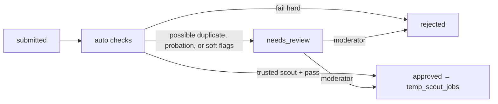

# 13 — Job Platform: Scout Mode

**App:** `platform-web` (scout area) · **Services:** `jobs`, `trust`, `payments`

## Purpose

Grow the job pool with high-quality jobs that are not on LinkedIn or Indeed. Scouts are paid for what their jobs **produce** (interviews, hires, paying companies), never for volume.

## Pages

| Page               | Must do                                                                                                                                                                                                                   |
| ------------------ | ------------------------------------------------------------------------------------------------------------------------------------------------------------------------------------------------------------------------- |
| **Submit a job**   | Modal/form: official apply URL, company name, title, location, salary (or equity), work mode, employment, job description. Live checks as they type (URL reachable, duplicate warning). AI analysis generates the skills. |
| **My submissions** | Status per submission (checking, needs review, approved, rejected, duplicate) with reasons; per-job stats (applications, interviews, hires).                                                                              |
| **Earnings**       | Pending (held), released, paid; breakdown by reward type; payout settings.                                                                                                                                                |
| **Level & limits** | Current level, daily submission limit, next-level requirements, quality metrics.                                                                                                                                          |

## Submission pipeline



### Auto checks (all run as background jobs, results in `auto_check_results`)

| Check                | Rule                                                                                                                                                                                             | Result on failure   |
| -------------------- | ------------------------------------------------------------------------------------------------------------------------------------------------------------------------------------------------ | ------------------- |
| URL reachable        | HTTP 200 after redirects, within 10 s                                                                                                                                                            | reject              |
| Official source      | Final host is the company domain or a known ATS host (`boards.greenhouse.io`, `jobs.lever.co`, `jobs.ashbyhq.com`, `*.myworkdayjobs.com`, `jobs.smartrecruiters.com`, …). Not another job board. | reject              |
| Company/domain match | Company name ↔ domain/ATS board token resolves to one company                                                                                                                                    | review              |
| Still open           | Page contains an apply form/button; no "position filled" markers; ATS API says open (where available)                                                                                            | reject              |
| Duplicate            | Apply-link or company+title match with an active job or submission. Shown to the scout; they may claim it is distinct. Never auto-rejected.                                                      | review              |
| Scam heuristics      | Payment requests, Telegram/WhatsApp contact, crypto, unrealistic salary for role/location, domain age < 30 days                                                                                  | reject + trust flag |
| Content              | Summary is the scout's own words (similarity to source page < threshold)                                                                                                                         | review              |

## Levels

| Level     | Daily limit | Review                            | Approval reward       | Interview reward multiplier |
| --------- | ----------- | --------------------------------- | --------------------- | --------------------------- |
| Probation | 10          | Manual review of every submission | $0                    | 1.0×                        |
| Trusted   | 50          | Auto-approve if checks pass       | small credit (config) | 1.0×                        |
| Expert    | 150         | Auto-approve; spot checks         | small credit          | 1.25×                       |

Promotion requires e.g. ≥ 30 approved submissions, ≥ 90% approval rate, ≤ 5% duplicate/expired rate, ≥ 10% of jobs producing ≥ 1 interview. Demotion on falling below thresholds or upheld reports.

## Rewards

See amounts in [50-pricing-and-revenue.md](50-pricing-and-revenue.md#scouts).

| Reward             | Trigger event                                                                        | Hold                               |
| ------------------ | ------------------------------------------------------------------------------------ | ---------------------------------- |
| Approval           | `scout.submission.approved` (Trusted+)                                               | 14 days                            |
| Interview          | `interview.settled` on a job from this scout                                         | released with interview settlement |
| Hire               | `hire.confirmed` on the job                                                          | 14 days                            |
| Company conversion | `company.claimed` + that company's paid interviews for 3–6 months (% of company fee) | monthly                            |

Rules:

- Payouts require tier 2 verification and tax info; $25 minimum; 14-day hold.
- A scout never earns on an interview where they are also the client, bidder, or linked to them (device/IP/payout account). See [32-trust-and-safety.md](32-trust-and-safety.md).
- Rewards are clawed back if the job is later found to be fake or the interview voided.

## Implementation (September 2026)

Built as Scoutwell (`scoutwell-frontend`, port 3003) on `joined-backend/internal/scout`, with moderation in `joined-admin` → Scouting. The full protocol, including API keys for outsourcing partners, is in [61-scout-api.md](61-scout-api.md). Differences from the target below:

- Status names match the target: `submitted`, `auto_checking`, `needs_review`, `approved`, `rejected`, `duplicate`; an approved job that closes keeps `approved` with `expired: true`.
- "URL reachable" rejects only definite failures (404/410, unknown domain, private address). A timeout or a site that blocks bots (403/429/5xx) goes to review instead, so good jobs on protected career sites are not lost.
- "Already on major boards" is no longer a scout toggle or a check. Scouted listings stay hidden-job.
- Domain age is not checked yet.
- Interview and hire rewards are recorded by staff on the submission until interview tracking emits `interview.settled` and `hire.confirmed`. Company conversion rewards are not paid yet.
- Identity (tier 2) is a staff decision on the legal name and country the scout sends; there is no ID vendor yet. Tax ids and payout accounts are stored as the last four characters only.

## API

```
POST   /v1/scout/submissions            {url, company_name, title, location_text, workplace, employment, pay | equity, summary}
GET    /v1/scout/submissions?status=&cursor=
GET    /v1/scout/submissions/{id}
POST   /v1/scout/submissions/precheck   {url} -> {reachable, official, still_open}
POST   /v1/scout/submissions/matches    {url, company_id?, company_name, title} -> {matches}
GET    /v1/scout/stats                  -> level, limits, metrics
GET    /v1/scout/earnings?cursor=
```

## Events

Emits: `scout.submission.created`, `scout.submission.approved`, `scout.submission.rejected`, `scout.level.changed`. Consumes: `interview.settled`, `hire.confirmed`, `company.claimed`, `job.expired`, `fraud.flagged`.

## Background jobs

- `scout.autocheck` on submit (timeout 60 s, retries 2).
- `jobs.reverify_open` daily for scouted jobs; mark expired when closed (affects scout expired-rate metric).
- `scout.levels.recompute` nightly.

## Acceptance criteria

- A submission pointing to another job board is rejected automatically with reason "not an official source".
- Two scouts submitting the same job: matches are shown; the scout may claim it is distinct; staff decide.
- A probation scout's submission never publishes without moderator approval.
- Scout interview reward is created only after the interview is settled (not merely confirmed).
