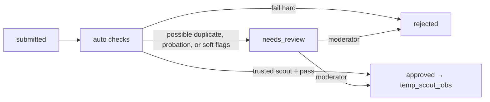

# 13 — Scout: Scout Mode

**App:** Scout web (Scoutwell, `scoutwell-frontend`) · **Services:** `jobs`, `trust`, `payments`

## Purpose

Grow job supply with jobs and **whole career pages** that are not on the big boards, so supply compounds. Scouts are paid on **usage and interviews**, never per submission: a share of Premium revenue, $1 per external first interview, and a bonus when a scouted company starts paying.

Scouts submit career pages and ATS boards, not just single jobs. **Hidden** means not on major boards when submitted. **The first approved scout owns the job**; hidden status ends when it appears publicly.

## Pages

| Page               | Must do                                                                                                                                                                                                                    |
| ------------------ | -------------------------------------------------------------------------------------------------------------------------------------------------------------------------------------------------------------------------- |
| **Submit a job**   | Modal/form: official apply URL, company name, title, location, salary (or equity), work mode, employment, short summary. Live checks as they type (URL reachable, duplicate warning). Skills and tags are added in review. |
| **My submissions** | Status per submission (checking, needs review, approved, rejected, duplicate) with reasons; per-job stats (applications, interviews, hires).                                                                               |
| **Earnings**       | Pending (held), released, paid; breakdown by reward type (pool share, interview bonus, conversion bonus); payout settings.                                                                                                 |
| **Level & limits** | Current level, daily submission limit, next-level requirements, quality metrics.                                                                                                                                           |

## Submission pipeline



### Auto checks (all run as background jobs, results in `auto_check_results`)

| Check                | Rule                                                                                                                                                                                             | Result on failure   |
| -------------------- | ------------------------------------------------------------------------------------------------------------------------------------------------------------------------------------------------ | ------------------- |
| URL reachable        | HTTP 200 after redirects, within 10 s                                                                                                                                                            | reject              |
| Official source      | Final host is the company domain or a known ATS host (`boards.greenhouse.io`, `jobs.lever.co`, `jobs.ashbyhq.com`, `*.myworkdayjobs.com`, `jobs.smartrecruiters.com`, …). Not another job board. | reject              |
| Company/domain match | Company name ↔ domain/ATS board token resolves to one company                                                                                                                                    | review              |
| Still open           | Page contains an apply form/button; no "position filled" markers; ATS API says open (where available)                                                                                            | reject              |
| Duplicate            | Apply-link or company+title match with an active job or submission. Shown to the scout; they may claim it is distinct. Never auto-rejected.                                                      | review              |
| Scam heuristics      | Payment requests, Telegram/WhatsApp contact, crypto, unrealistic salary for role/location, domain age < 30 days                                                                                  | reject + trust flag |
| Content              | Summary is the scout's own words (similarity to source page < threshold)                                                                                                                         | review              |

## Levels

| Level     | Daily limit | Review                            |
| --------- | ----------- | --------------------------------- |
| Probation | 10          | Manual review of every submission |
| Trusted   | 50          | Auto-approve if checks pass       |
| Expert    | 150         | Auto-approve; spot checks         |

Promotion requires e.g. ≥ 30 approved submissions, ≥ 90% approval rate, ≤ 5% duplicate/expired rate, ≥ 10% of jobs producing ≥ 1 interview. Demotion on falling below thresholds or upheld reports. Levels raise limits and review speed; **they do not change the reward amounts.**

## How scouts earn

Full numbers and the worked example are in [50-pricing-and-revenue.md](50-pricing-and-revenue.md#scouts).

| #   | Reward                       | Amount                                                                                                                                                                           | Trigger / rule                                                                                                            | Hold                               |
| --- | ---------------------------- | -------------------------------------------------------------------------------------------------------------------------------------------------------------------------------- | ------------------------------------------------------------------------------------------------------------------------- | ---------------------------------- |
| 1   | **Base pay: Premium pool**   | 20% of each Premium payment ($4 of $20), split evenly across the **distinct hidden jobs** that Premium user applied to that month; each scout collects the shares for their jobs | Month-end allocation ([03](03-data-model.md) `scout_pool_allocations`)                                                    | Monthly, then payout hold          |
| 2   | **Interview bonus**          | **$1**, paid by OpenSeat                                                                                                                                                         | An **external** candidate's **first** interview is scheduled on the scout's job (`interview.settled`, number 1, external) | Released with interview settlement |
| 3   | **Company conversion bonus** | Amount from the price book                                                                                                                                                       | A scouted company claims its page, registers, and starts paying (`company.registered` + first settled fee)                | Monthly                            |

Rules:

- Payouts require tier 2 verification and tax info; $25 minimum; payout hold (default 14 days).
- **No per-submission pay.** Approval alone earns nothing.
- A scout never earns on an interview or pool share where they are also the candidate or are linked to them (device/IP/payout account). See [32-trust-and-safety.md](32-trust-and-safety.md).
- Rewards are clawed back if the job is later found to be fake or the interview is voided.
- The first approved scout owns the job; if a job is merged as a duplicate, the earlier approved submission keeps ownership.
- Example (estimate, not a promise): with 10,000 Premium users, 20,000 active hidden jobs and about $2.75 earned per active job a month, a scout adding 20 hidden jobs a day can reach about $1,650 a month.

## Implementation (September 2026)

Built as Scoutwell (`scoutwell-frontend`, port 3003) on `opened-backend/internal/scout`, with moderation in `opened-admin` → Scouting. The full protocol, including API keys for outsourcing partners, is in [61-scout-api.md](61-scout-api.md). Differences from the target below:

- Status names match the target: `submitted`, `auto_checking`, `needs_review`, `approved`, `rejected`, `duplicate`; an approved job that closes keeps `approved` with `expired: true`.
- "URL reachable" rejects only definite failures (404/410, unknown domain, private address). A timeout or a site that blocks bots (403/429/5xx) goes to review instead, so good jobs on protected career sites are not lost.
- "Already on major boards" is no longer a scout toggle or a check. Scouted listings stay hidden-job.
- Domain age is not checked yet.
- Interview rewards are recorded by staff on the submission until interview tracking emits `interview.settled`; the target `$1` bonus and the Premium pool share are not automated yet. Company conversion rewards are not paid yet. (Earlier hire and per-seniority rewards are retired.)
- Identity (tier 2) is a staff decision on the legal name and country the scout sends; there is no ID vendor yet. Tax ids and payout accounts are stored as the last four characters only.

## API

```
POST   /v1/scout/submissions            {url, company_name, title, location_text, workplace, employment, pay | equity, summary}
GET    /v1/scout/submissions?status=&cursor=
GET    /v1/scout/submissions/{id}
POST   /v1/scout/submissions/precheck   {url} -> {reachable, official, still_open}
POST   /v1/scout/submissions/matches    {url, company_id?, company_name, title} -> {matches}
GET    /v1/scout/stats                  -> level, limits, metrics
GET    /v1/scout/earnings?cursor=
```

## Events

Emits: `scout.submission.created`, `scout.submission.approved`, `scout.submission.rejected`, `scout.level.changed`. Consumes: `interview.settled`, `subscription.paid`, `company.registered`, `job.expired`, `job.hidden_ended`, `fraud.flagged`.

## Background jobs

- `scout.autocheck` on submit (timeout 60 s, retries 2).
- `jobs.reverify_open` daily for scouted jobs; mark expired when closed (affects scout expired-rate metric).
- `scout.levels.recompute` nightly.
- `scout.pool.allocate` monthly: split each Premium payment's 20% across the hidden jobs applied to, per scout owner.

## Acceptance criteria

- A submission pointing to another job board is rejected automatically with reason "not an official source".
- Two scouts submitting the same job: matches are shown; the scout may claim it is distinct; staff decide.
- A probation scout's submission never publishes without moderator approval.
- Scout interview bonus ($1) is created only after the interview is settled (not merely confirmed), only for an **external** candidate's **first** interview on a scouted job.
- A submission alone never creates a payable amount.
- The Premium pool share for a month sums to exactly 20% of that month's Premium payments allocated to hidden jobs.
