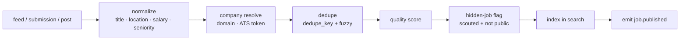

# 14 — Job Pool, Ingestion, Search and Matching

**Services:** `jobs` (pool, ingestion, search index), `matching` (fit scoring, recommendations)

## Purpose

Maintain one clean, deduplicated, verifiably open pool of jobs from three sources, make it searchable, and recommend jobs to candidates. The pool feeds the candidate's own applications; nothing applies automatically ([22](22-no-bot-applications.md)).

## Sources

| Source     | How                                                                                                                              | Notes                                  |
| ---------- | -------------------------------------------------------------------------------------------------------------------------------- | -------------------------------------- |
| Direct     | Company posts on-platform (free)                                                                                                 | Company apply link → internal          |
| Aggregated | **Permitted** feeds only: ATS public job feeds (e.g. Greenhouse/Lever/Ashby board APIs), partner feeds, XML feeds from employers | Applicants are external                |
| Scouted    | Scout-added jobs and career pages after quality check; **hidden** until public                                                   | Applicants are external; Premium-first |

**Fees follow who brought the candidate, not the job source** ([50](50-pricing-and-revenue.md)). A candidate who applies to an aggregated or scouted job through OpenSeat is external ($20 to a registered company). If that company later registers, the same job can be converted to direct.

The pool is moving away from third-party aggregation toward ATS public job feeds, scout-added career pages and direct posts, with a per-source kill switch and a target of under 20% of interviews from third-party boards before scaling ([70](70-roadmap.md)).

**Compliance rule:** do not scrape sites whose terms prohibit it (LinkedIn, Indeed, etc.). Store a structured summary plus the official apply link; do not republish full descriptions copied from third parties.

## Ingestion pipeline



- **Normalize:** title normalization (taxonomy mapping to role family + seniority), geocoding, salary to annual cents, employment type.
- **Company resolution:** match by domain, ATS board token, then fuzzy name; create `unclaimed` company if none.
- **Dedupe:** exact `dedupe_key`; fuzzy (same company, title similarity > 0.9, same location, posted within 30 days) → merge, keeping the best source (direct > scouted > aggregated).
- **Quality score (0–100):** official link present and open, salary present, complete location, company verified/claimed, low report rate, recency.
- **Hidden status:** scouted jobs are `is_hidden` until they appear on a public board or feed (`job.hidden_ended`); scouted career pages are re-crawled for new jobs on permitted terms.
- **Expiry:** `jobs.reverify_open` checks active jobs (daily for scouted/aggregated, weekly for direct unless company pauses). Closed → `expired`, `job.expired` emitted; saved jobs and applications update.

## Search

- Index fields: title, normalized title, role family, skills, company, locations (geo_point), remote, salary range, seniority, employment type, source, posted_at, quality_score, visa.
- Ranking: text relevance × recency decay × quality score; boost direct jobs slightly; never let paid promotion override relevance filters.
- Hidden jobs are returned to **Premium** seekers first; free seekers see a teaser (title, company, location) until the exclusivity window ends or the job goes public.
- Facet counts returned with results. Cursor pagination.

## Fit score (candidate ↔ job)

Computed by `matching` when a job is published or a candidate's profile changes. Used for recommendations and applicant sorting only.

| Component                                    | Weight (initial)                 |
| -------------------------------------------- | -------------------------------- |
| Role/title similarity (embedding + taxonomy) | 30                               |
| Skills overlap (resume vs requirements)      | 25                               |
| Seniority match                              | 15                               |
| Location/remote match                        | 10                               |
| Salary ≥ candidate floor                     | 10                               |
| Work authorization / visa compatibility      | 10 (hard filter if incompatible) |

Hard filters (score = 0): visa incompatible, already applied. Store `reasons` (top 3 matching and missing factors) for display. Recalibrate weights monthly using **confirmed interview** outcomes; version every model (`model_version`).

## API

```
GET  /v1/jobs/search …                       (public)
GET  /v1/me/recommendations?cursor=
GET  /v1/admin/ingestion/sources             POST/PATCH sources
```

## Events

`job.published`, `job.updated`, `job.expired`, `job.hidden_ended`, `job.merged {from,to}`, `fit.computed {candidate_user_id, job_id, score}`.

## Acceptance criteria

- Two feeds containing the same job produce one job with both source refs.
- A closed job is marked expired within 24 h (scouted/aggregated) and disappears from search.
- A free seeker never receives hidden-job details during the Premium window.
- A scouted job that appears on a public board gets `hidden_ended_at` within 24 h and loses the Premium-first flag.
