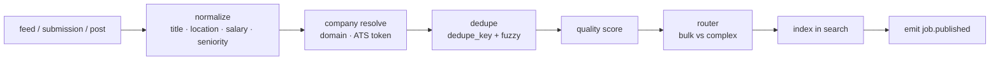

# 14 — Job Pool, Ingestion, Search and Matching

**Services:** `jobs` (pool, ingestion, search index), `matching` (fit scoring, routing)

## Purpose

Maintain one clean, deduplicated, verifiably open pool of jobs from three sources, make it searchable, score it against each client, and decide whether each job goes to the AI agent or a human bidder.

## Sources

| Source | How | Company fee? |
|---|---|---|
| Direct | Company posts on-platform | Yes |
| Aggregated | **Permitted** feeds only: ATS public job-board APIs (e.g. Greenhouse/Lever/Ashby board APIs), partner feeds, XML feeds from employers, ATS job-board partner programs | No |
| Scouted | Scout submissions after quality check | No (until company claims) |

**Compliance rule:** do not scrape sites whose terms prohibit it (LinkedIn, Indeed, etc.). Store a structured summary plus the official apply link; do not republish full descriptions copied from third parties.

## Ingestion pipeline



- **Normalize:** title normalization (taxonomy mapping to role family + seniority), geocoding, salary to annual cents, employment type.
- **Company resolution:** match by domain, ATS board token, then fuzzy name; create `unclaimed` company if none.
- **Dedupe:** exact `dedupe_key`; fuzzy (same company, title similarity > 0.9, same location, posted within 30 days) → merge, keeping the best source (direct > scouted > aggregated).
- **Quality score (0–100):** official link present and open, salary present, complete location, company verified/claimed, low report rate, recency.
- **Expiry:** `jobs.reverify_open` checks active jobs (daily for scouted/aggregated, weekly for direct unless company pauses). Closed → `expired`, `job.expired` emitted, pending assignment items for that job become `expired` and clients are offered replacements.

## Search

- Index fields: title, normalized title, role family, skills, company, locations (geo_point), remote, salary range, seniority, employment type, source, posted_at, quality_score, visa.
- Ranking: text relevance × recency decay × quality score; boost direct jobs slightly; never let paid promotion override relevance filters.
- Facet counts returned with results. Cursor pagination.

## Fit score (client ↔ job)

Computed by `matching` when a job is published or a client's profile/rules change.

| Component | Weight (initial) |
|---|---|
| Role/title similarity (embedding + taxonomy) | 30 |
| Skills overlap (resume vs requirements) | 25 |
| Seniority match | 15 |
| Location/remote match | 10 |
| Salary ≥ client floor | 10 |
| Work authorization / visa compatibility | 10 (hard filter if incompatible) |

Hard filters (score = 0): company on client's do-not-apply list, job policy `direct_only`, visa incompatible, already applied/assigned.

Store `reasons` (top 3 matching and missing factors) for display. Recalibrate weights monthly using **confirmed interview** outcomes (logistic regression on historical applications); version every model (`model_version`).

## Router: bulk vs complex

Phase 1 validated splitting the pool: **bulk ATS forms → AI agent; complex forms → human bidder.**

| Signal | Route |
|---|---|
| ATS in `bulk_ats` list (config; default Greenhouse, Ashby, Lever) and form signature known and stable | agent |
| Workday, iCIMS, Taleo, SuccessFactors, custom portals | human |
| Required account creation on employer site | human |
| > N custom screening questions (default 5) or essay questions | human |
| Agent historical success rate for this form signature < 90% | human |
| Unknown | human (and agent probes form in the background to learn signature) |

Admins can override per company or per job. Decisions stored in `routing_decisions`.

## API

```
GET  /v1/jobs/search …                       (public)
GET  /v1/clients/{id}/job-feed?min_fit=&route=&cursor=   (Connect Jobs tab)
POST /v1/admin/routing/overrides             {company_id|job_id, route}
GET  /v1/admin/ingestion/sources             POST/PATCH sources
```

## Events

`job.published`, `job.updated`, `job.expired`, `job.merged {from,to}`, `fit.computed {client_id, job_id, score}`, `route.decided`.

## Acceptance criteria

- Two feeds containing the same job produce one job with both source refs.
- A closed job is marked expired within 24 h (scouted/aggregated) and disappears from search and client feeds.
- A client never sees a job from their do-not-apply list in the Jobs tab.
- Router sends a Greenhouse job with 3 standard questions to the agent and a Workday job to a human.
