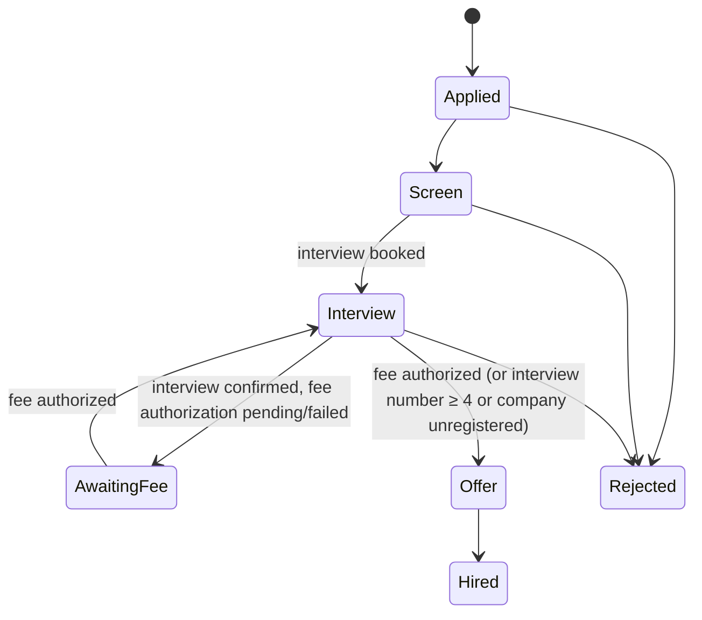

# 20 — Hire: ATS

**App:** Hire web · **Service:** `ats` (with `tracking`, `payments`, `assistant`)

## Purpose

An applicant tracking system for the whole hiring process, free of seats and contracts: job posts and a career page, the applicant pipeline, stages, scorecards and offers. Every applicant is tracked **from the first click**. Cost to the company is per interview only ([50](50-pricing-and-revenue.md)).

## Scope

| Capability             | What it does                                                                                                                                              |
| ---------------------- | --------------------------------------------------------------------------------------------------------------------------------------------------------- |
| **Job posts**          | Create, publish, pause, close jobs. Free for registered companies. Jobs also appear in Jobs search.                                                       |
| **Career page**        | Hosted page and embeddable widget at `careers.<domain>/{company}`. Applications through it are **internal**.                                              |
| **Company apply link** | A per-job and per-company link (`/apply/{token}`). Applications through it are **internal**.                                                              |
| **Pipeline**           | Configurable stages per job (default: Applied → Screen → Interview → Offer → Hired / Rejected). Drag-and-drop, bulk actions, filters by source and stage. |
| **Source labels**      | Every applicant shows **internal** or **external** from the source stamp.                                                                                 |
| **Scheduling**         | Slots, links, reminders, time zones, calendar sync. Detects interviews booked elsewhere.                                                                  |
| **Scorecards**         | Structured feedback per interview, pre-drafted by the AI assistant, submitted by a human.                                                                 |
| **Offers**             | Offer drafts, send, accept/decline tracking. Hired stage closes the job funnel.                                                                           |
| **Team & permissions** | Owner, admin, recruiter, interviewer, viewer.                                                                                                             |
| **Talent audit trail** | Every stage move, note and fee event is logged and kept with the company.                                                                                 |

## Source stamp and the ATS trail

1. A candidate reaches the apply form through a **channel**: `company_link`, `career_page` (→ `internal`) or `openseat_jobs`, `scout_hidden` (→ `external`), or `off_platform` (no stamp).
2. On the **apply click** the system writes an immutable `source_stamps` row and opens the application in the pipeline at the first stage.
3. The stamp travels with the application for life. It decides classification conflicts ([30](30-interview-tracking.md)). Companies cannot edit it.
4. If the same candidate applies through both channels, the **first touch** wins.

## Stage lock: "no fee, no next stage"



- When an interview is confirmed and its fee is not authorized, `applications.stage_locked = true`. The recruiter can still read the application, message the candidate, and reject; they **cannot advance** the candidate.
- Unlocks on `interview.fee_authorized` (or when the fee is $0: interview number ≥ 4, or the company is unregistered).
- Lock state is shown with the exact fee and a one-click "Pay now".
- Moving candidates to an off-platform tool to avoid the lock is detected by calendar sync ([30](30-interview-tracking.md)).

## Data

`applications`, `source_stamps`, `pipelines`, `stages`, `stage_moves`, `scorecards`, `offers`, `interview_events`. See [03-data-model.md](03-data-model.md#ats).

## API

```
GET    /v1/companies/{id}/pipelines               POST PATCH
GET    /v1/jobs/{id}/applications?stage=&source=&cursor=
GET    /v1/applications/{id}                      -> application, stamp, stage, lock, interviews, notes
POST   /v1/applications/{id}/move                 {to_stage_id}       (409 stage_locked when a fee is unpaid)
POST   /v1/applications/{id}/reject               {reason_code, message?}
POST   /v1/interviews/{id}/scorecards             {criteria, recommendation}
POST   /v1/applications/{id}/offers               {terms}
POST   /v1/offers/{id}/send | /withdraw
GET    /apply/{token}                             (candidate apply form; stamps source=internal)
```

## Events

Emits: `application.submitted`, `application.stage_changed`, `application.stage_locked`, `application.stage_unlocked`, `offer.sent`, `offer.accepted`. Consumes: `interview.fee_authorized`, `interview.fee_failed`, `interview.settled`, `assistant.notes.ready`.

## Edge cases

- Fee authorization fails after a candidate is already in `Interview` → stage lock; candidate is not told about the lock, only the company.
- Company changes the pipeline while candidates are in a removed stage → candidates move to the nearest stage; audit log records it.
- Candidate withdraws → application `withdrawn`; future interviews stay tracked until cancelled on the calendar.

## Acceptance criteria

- Every application has exactly one source stamp created at the apply click.
- `POST /move` on a locked application returns `409 stage_locked` with the amount owed.
- Applications through the company apply link or career page are labeled `internal`; through Jobs or Scout `external`.
- A rejection or message on a locked application is allowed.
