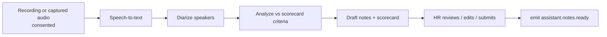

# 21 — Hire: AI Interview Assistant

**Service:** `assistant` (workers may be Python) · **App:** Hire web · **Included** in the per-interview fee ($5 / $20).

## Purpose

Give HR a transcript of each interview, an analysis of the answers, and drafted notes and scorecards, so interviewers type less and score more consistently. The assistant works **for the company, after the interview**. It never feeds answers to candidates and never makes a hiring decision.

## What it produces

| Output              | Content                                                                                     | Who sees it                 |
| ------------------- | ------------------------------------------------------------------------------------------- | --------------------------- |
| **Transcript**      | Speaker-labeled, time-stamped text                                                          | Company interviewers and HR |
| **Analysis**        | Answers mapped to the scorecard criteria with quotes as evidence; topics covered and missed | Company interviewers and HR |
| **HR notes**        | Short summary, strengths, open questions, follow-ups                                        | Company interviewers and HR |
| **Scorecard draft** | Pre-filled ratings and evidence; a human edits and submits                                  | Interviewer, then HR        |

Nothing is auto-rejected or auto-advanced. Ratings are suggestions; a human submits the scorecard.

## Pipeline



- Inputs: built-in video room audio, or a connected Zoom/Meet/Teams recording where available. No hidden capture: a visible indicator is shown while recording.
- Cost target: about **$0.60 per interview** in model and transcription cost (assumption, tracked in `interview_notes.cost_cents`; see [80](80-metrics-and-analytics.md)).
- Provider-agnostic interfaces for speech-to-text and LLM; zero-retention terms with providers ([90](90-compliance-privacy-security.md)).

## Consent and privacy

- **Explicit consent from all participants before recording**, recorded in `interview_recordings.consent`. Candidates are told before scheduling that the interview may be recorded and analyzed; a candidate may decline, and the interview then proceeds with **manual notes only**. Declining never affects fees or standing.
- Recording law varies by jurisdiction (one-party vs all-party consent) ⚖️; the strictest applicable rule is applied by default.
- Recordings are retained for a company-configurable period (default 90 days, max 12 months) then deleted; transcripts and notes follow the application retention rule.
- Candidates can request access to, and deletion of, their transcript ([90](90-compliance-privacy-security.md)).
- **AI in hiring compliance ⚖️:** analysis is disclosed to candidates, bias-monitored, and advisory only (NYC Local Law 144, EU AI Act, Illinois/Colorado rules as applicable). No emotion, voice-biometric or protected-trait inference.
- Candidate-visible notes are off by default (`visible_to_candidate = false`).

## Data

`interview_recordings`, `transcripts`, `interview_notes`, `scorecards`. See [03-data-model.md](03-data-model.md#assistant).

## API

```
POST   /v1/interviews/{id}/recording/consent   {participant, granted}
POST   /v1/interviews/{id}/recording/start | /stop
GET    /v1/interviews/{id}/transcript
GET    /v1/interviews/{id}/notes
POST   /v1/interviews/{id}/notes/regenerate
DELETE /v1/interviews/{id}/recording
```

## Events

Emits: `assistant.notes.ready`, `assistant.failed`. Consumes: `interview.confirmed`, `interview.settled`.

## Acceptance criteria

- No recording starts unless every participant has consented.
- If a candidate declines, no audio is stored and the interview still confirms and bills normally.
- Notes are never marked final without a human submit.
- Deleting a recording deletes audio, transcript and analysis within 24 h; the scorecard the human submitted stays.
