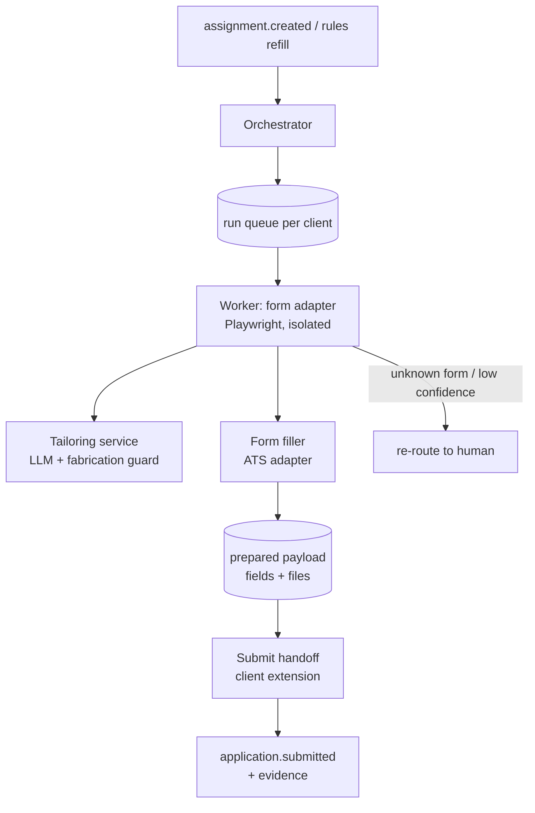

# 22 — Connect: AI Agent

**Service:** `agent` (orchestrator + workers; Python or TypeScript) · **App:** `extension` (submit handoff)

## Purpose

Prepare high volumes of well-matched applications for **bulk ATS forms** (Greenhouse, Ashby, Lever-style) at near-zero marginal cost, while the **candidate clicks the final submit**. Complex forms go to human bidders.

## Validated Phase 1 benchmark

| Metric             | Value                                                  |
| ------------------ | ------------------------------------------------------ |
| Throughput         | ~150 applications per run, ~1 hour                     |
| Compute cost       | ~$0.50 per day (per client at 150/day)                 |
| Outcome            | ~5 interviews/week (~0.5% interview rate on bulk jobs) |
| Cost per interview | ~$0.70                                                 |
| Submit             | Clicked by the job hunter                              |
| Known weakness     | Fails on complex/custom forms → routed to humans       |

## Architecture



### Components

| Component             | Responsibility                                                                                                                                                                                                                                             |
| --------------------- | ---------------------------------------------------------------------------------------------------------------------------------------------------------------------------------------------------------------------------------------------------------- |
| **Orchestrator**      | Pulls eligible `applications` with `route = agent`, enforces quotas and per-company caps, schedules runs, tracks `agent_runs`, retries.                                                                                                                    |
| **ATS adapters**      | One module per ATS (`greenhouse`, `ashby`, `lever`, …). Knows field mapping, file upload fields, standard questions, confirmation signals. Versioned; tested nightly against fixture pages.                                                                |
| **Form reader**       | Loads the official apply page in an isolated headless browser (read-only; never submits), extracts the form schema (fields, types, required, options) and computes `form_signature_hash`.                                                                  |
| **Answer resolver**   | Maps each field to: profile data, saved client answers, tailored content, or `needs_client_input`. Legal/eligibility questions are **never** auto-answered unless the client saved an explicit answer.                                                     |
| **Tailoring service** | Optional short cover letter / "why this role" answers and resume emphasis. Must pass the fabrication guard.                                                                                                                                                |
| **Fabrication guard** | Extracts claims (employers, titles, dates, degrees, certifications, skills with years) from generated text and checks each exists in the client's approved resume/profile. Any unsupported claim → remove or flag; flagged payloads require client review. |
| **Payload store**     | Saves `agent_prepared_payloads` (field → value, attachments) with 72 h expiry.                                                                                                                                                                             |
| **Submit handoff**    | Client-side browser extension opens the official page in the client's own browser, autofills from the payload, attaches the resume, and **the client clicks submit**. Extension captures confirmation.                                                     |
| **Learning loop**     | Records success/failure per `form_signature_hash`; router moves signatures below 90% success to human.                                                                                                                                                     |

## Submit handoff

Why client-side: the application is submitted from the candidate's own browser, session and network, with the candidate's explicit action, which matches consent principles and avoids automated submission from our infrastructure.

Flow:

1. Client opens **Submit queue** in `connect-web` (or extension popup) → sees N ready applications with job, fit, answers.
2. Client clicks _Start_: extension opens the first job's official URL in a tab and autofills.
3. Client reviews and clicks the site's own **Submit** button.
4. Extension detects the confirmation page/state (adapter-specific), screenshots it, reads the uploaded file name/hash, posts evidence to `POST /v1/extension/applications/{id}/submitted`, and opens the next one.
5. Target: ≤ 20 seconds of client time per application. 150 applications ≈ under 1 hour of clicking (matches Phase 1).

Fallbacks: if autofill fails on a field, the extension highlights it and shows the value to paste; if the page changed, mark `failed` with reason and re-route to human.

> Align with the Phase 1 implementation: if Phase 1 used a different handoff (e.g. streamed remote browser), document it here and keep the same invariants — **client performs the final submit; evidence captured; no CAPTCHA bypass**.

## Hard rules

- **Never** bypass CAPTCHAs, bot protection, rate limits, or login walls. If encountered → route to human or client.
- **Never** create accounts on employer sites on the client's behalf.
- Only apply where the job's policy is not `direct_only` and the company hasn't blocked assisted applications.
- Respect per-company cap (default 3 roles per company per 30 days per client) and the client's daily cap.
- Every application labeled as AI-prepared in our records; on direct jobs the company sees an "AI-prepared, candidate-submitted" label.
- Log every model call's inputs/outputs by reference (no raw PII in logs), model version, and cost.

## Tiers (client-facing)

| Tier       | What the agent does                                                          | Notes                |
| ---------- | ---------------------------------------------------------------------------- | -------------------- |
| AI Basic   | Bulk jobs only, rules-based, up to plan cap                                  | Client clicks submit |
| AI + Human | Agent for bulk, human bidder for complex, human reviews agent output samples | Blended              |

## Quotas and scaling

- Default agent quota per client: 150 prepared applications/day (Phase 1), adjustable by plan and by the client's interview/"not relevant" record.
- Workers are stateless containers; one browser context per job; hard timeout 90 s per form read; concurrency limited per ATS host to be polite (default 2 concurrent per host per worker pool).
- Cost tracking per run: compute + LLM tokens → `agent_runs.compute_cost_cents`.

## API

```
POST /v1/internal/agent/runs                 {assignment_id}          (orchestrator)
GET  /v1/connect/submit-queue                                       (client)
GET  /v1/extension/applications/{id}/payload                         (extension, short-lived token)
POST /v1/extension/applications/{id}/opened
POST /v1/extension/applications/{id}/submitted {evidence_key, uploaded_file_sha256, confirmation_signals}
POST /v1/extension/applications/{id}/failed    {reason, field?}
```

Extension auth: device-bound token issued after sign-in; payload URLs are single-use and expire in 10 minutes.

## Events

Emits: `agent.run.started`, `agent.application.prepared`, `agent.application.flagged {fabrication}`, `agent.run.failed`, `application.submitted {actor_type: agent}`. Consumes: `assignment.created`, `engagement.paused`, `job.expired`, `route.decided`.

## Testing

- Fixture library of saved ATS form pages per adapter version; nightly contract tests.
- Canary: new adapter versions roll out to 5% of runs first.
- Fabrication guard test set with seeded false claims; must catch ≥ 99%.

## Acceptance criteria

- A payload with any claim not present in the approved resume is flagged and cannot enter the submit queue without client review.
- A job whose form contains a CAPTCHA before submit is never processed server-side beyond form reading; it is routed to human/client.
- 150 prepared applications cost ≤ $1.00 in compute (target; Phase 1 ≈ $0.50).
- Every agent application reaching `submitted` has evidence and a client submit action recorded by the extension.
