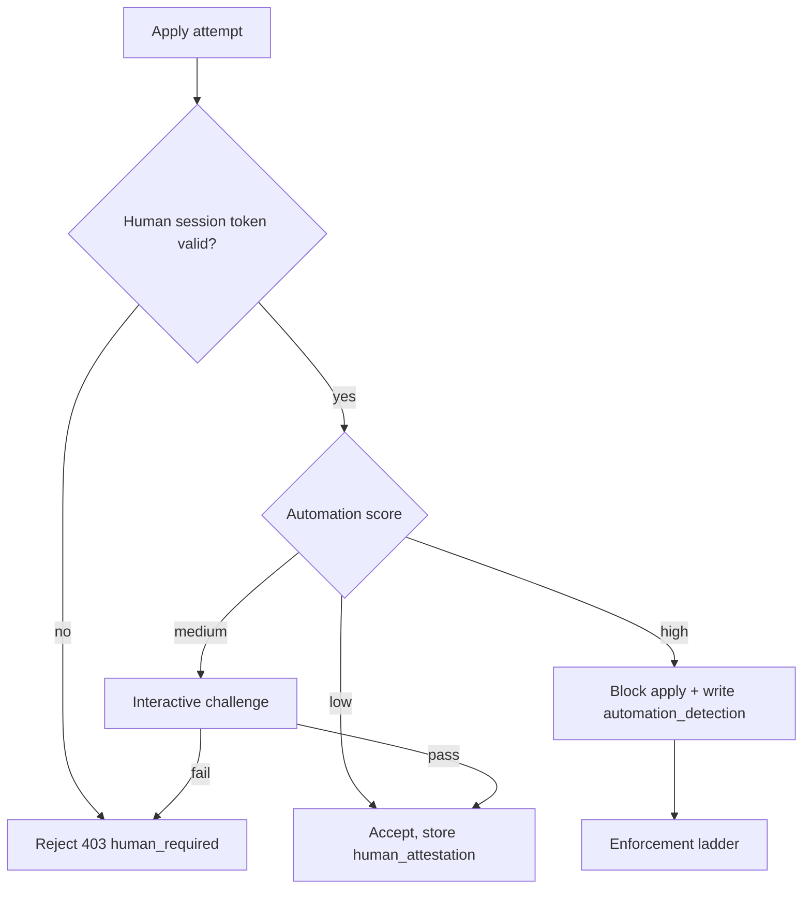

# 22 — No Bot Applications

**Owners:** `identity`, `ats`, `trust` · **Applies to:** every apply surface on OpenSeat (Jobs, company apply links, career pages).

## Policy

**OpenSeat bans bot participation in job applications.** Every application must be started, completed and submitted **personally, by the verified candidate, in a live browser session.**

Banned:

- Auto-apply tools and browser extensions that fill or submit forms.
- AI agents or scripts (including headless browsers and browser-automation frameworks) applying on a candidate's behalf.
- "Apply-for-you" services, human or automated, including human bidders who submit for someone else.
- Bulk or scripted application to OpenSeat or company-page apply links.
- Sharing an account so another person can apply as the candidate.

Allowed:

- The candidate using ordinary browser autofill and password managers.
- Accessibility technology (screen readers, voice control).
- Resume builders and writing help **outside** the apply flow, as long as the candidate reviews and submits.
- Scouts adding jobs through the Scout API ([61](61-scout-api.md)). Scouting is job supply, not applying; scout API keys cannot apply.

Why: the interview is the currency ([00](00-product-overview.md)). Bots inflate volume, flood companies, and can fabricate signal. Human-only applications keep the record of who brought whom trustworthy and keep the fee model honest for both sides.

## Enforcement layers

| Layer                    | Control                                                                                                                                                |
| ------------------------ | ------------------------------------------------------------------------------------------------------------------------------------------------------ |
| **No apply API**         | There is no public or partner endpoint to submit an application. `POST /v1/jobs/{id}/apply` and `/apply/{token}` accept only first-party web sessions. |
| **Verified human**       | Tier 1+ (phone, device) to apply; tier 2 (ID + liveness) for on-platform interviews and Premium ([10](10-identity-and-accounts.md)).                   |
| **Live-session check**   | Short-lived, single-use apply token issued when the form is opened in a real browser; bound to session and device; rejects replay.                     |
| **Automation detection** | Headless/webdriver fingerprints, synthetic input timing, known auto-apply extensions, form-fill speed, datacenter ASNs, multi-account devices.         |
| **Step-up challenge**    | On medium risk, an interactive challenge before submit; on failure the apply is refused.                                                               |
| **Rate limits**          | Per candidate: applications per hour and per day (config, sized for humans). Per device and per IP as well.                                            |
| **Company reporting**    | Companies can flag an applicant as `suspected_bot` (an objective reason code, [32](32-trust-and-safety.md)).                                           |
| **Terms**                | Candidate terms prohibit bot and delegated applying; violation is grounds for enforcement.                                                             |

## What happens on detection



- Accepted applications store `human_attestation` (session id, device id, risk score, challenge result) for audit.
- **Repeat or high-confidence** detection follows the enforcement ladder in [32](32-trust-and-safety.md): warning → apply cooldown → apply suspension → account suspension → ban with face-template block.
- Applications later proven automated are **withdrawn**; the company sees them as `withdrawn`, and any unsettled fee on those interviews is voided.
- Honest users are not punished for VPNs or browser extensions such as password managers; only automation signals matter.

## Company-side controls

Companies need no configuration: bots are blocked at the platform. Companies keep a per-job option to require tier 2 verification for applicants (config, off by default).

## API and errors

```
403 human_required        {detail: "Applications must be submitted by you in the browser."}
403 automation_detected   {detail: "Automated activity was detected on this account."}
429 rate_limited          (with Retry-After)
POST /v1/reports  {reason_code: "suspected_bot", subject_type: "application", subject_id}
```

## Events

`automation.detected {surface, action}`, `application.withdrawn {reason: "bot"}`, `account.restricted`.

## Acceptance criteria

- No endpoint exists that accepts an application without a valid single-use apply token from a first-party session.
- A headless-browser apply attempt is rejected and creates an `automation_detections` row.
- A Scout API key calling any apply path receives `403 forbidden`.
- A confirmed bot application is withdrawn and any fee tied to it is voided.
- Normal browser autofill does not trigger a challenge.
