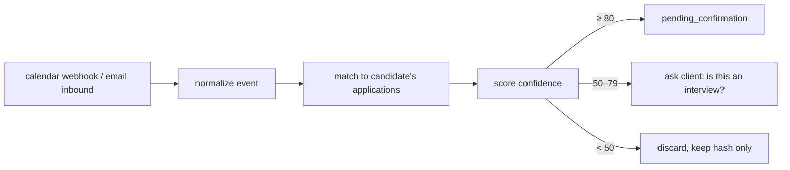

# 30 — Interview Tracking

**Service:** `tracking` · **Apps:** `platform-web`, `connect-web`

## Purpose

Reliably know when a candidate had an interview, because **every price and payout depends on it**. Clients may be tempted to hide interviews (they pay per interview); bidders/scouts may be tempted to fake them (they earn per interview). Evidence must come from the company side and be collected automatically wherever possible.

## Signal sources

| Source                     | How                                                                                | Strength                               | Required?                   |
| -------------------------- | ---------------------------------------------------------------------------------- | -------------------------------------- | --------------------------- |
| **On-platform scheduling** | Company schedules in-product (direct jobs)                                         | Strongest                              | Standard for direct jobs    |
| **Calendar connection**    | Google Calendar / Microsoft Graph, read-only events scope, push notifications      | Strong; also proves the event happened | Default for Connect clients |
| **Email forwarding**       | Client auto-forwards job-related mail to a private address `u-<token>@in.<domain>` | Strong; catches phone screens          | Alternative/backup          |
| **Platform apply email**   | Applications use `<name>.<token>@apply.<domain>`, which forwards to the client     | Strongest for off-platform             | Optional                    |
| **Manual + evidence**      | Client or bidder reports with screenshot                                           | Weak                                   | Fallback                    |

Connect plans with per-interview pricing **require** calendar or email forwarding.

## Detection pipeline



### Normalization

Extract: organizer email/domain, attendee domains, title, description text, start/end, conferencing link, cancellation status, provider event ID. For email: sender, subject, body, ICS attachments, scheduling links (Calendly, GoodTime, Gem, Greenhouse/Ashby/Lever scheduling).

### Matching

Candidate's open applications (last 120 days) → match by:

- organizer/sender domain ∈ company domains, or ATS scheduling domain + company name in text,
- company or job title mentioned in title/body,
- time proximity (event after application submit).

### Confidence score (0–100)

| Signal                                                                | Points |
| --------------------------------------------------------------------- | ------ |
| External organizer from company domain                                | +40    |
| Known ATS/scheduler sender + company name present                     | +35    |
| "interview", "screen", "chat with", round keywords in title           | +15    |
| Video link present                                                    | +5     |
| Event created by the client themself (not external organizer)         | −30    |
| Matches exactly one open application                                  | +10    |
| Duplicate of an existing interview event (same job, overlapping time) | merge  |

Round number: incremented per `(candidate, job)` in chronological order; client can correct.

## Confirmation

- After `scheduled_end`, if not cancelled, the client gets a one-tap prompt: _Did this interview happen?_ Yes / No (cancelled) / No-show / Not an interview.
- **Auto-confirm** if the client doesn't answer within 72 h and confidence ≥ 90 with an external organizer; client can still dispute during the hold.
- On confirm: `interview.confirmed` → billing; status `held` until `hold_until` (default 7 days bidder, 14 days scout).
- On-platform interviews confirm automatically from attendance.

## Disputes

Either party may dispute during the hold period (client: "wasn't a real interview"; bidder: "client hid an interview"; company: "candidate didn't attend"). Disputes open a moderation case with all evidence; outcome `settled` or `voided`; money follows the outcome. See [32-trust-and-safety.md](32-trust-and-safety.md).

## Hidden-interview detection

Flag for review when: an application's company emails a scheduling link to the forward address but no calendar event follows; a job's status changes to "offer" without any confirmed interview; a client disconnects tracking shortly after a high-confidence detection.

## Client-side value (drives adoption)

Reminders with prep notes, conflict warnings, weekly timeline, availability sharing for scheduling links (client approves before anything is booked).

## Privacy

- Minimum scopes: Google `calendar.events.readonly` (or narrower), Microsoft `Calendars.Read`. No write scope unless the client enables scheduling help (separate consent).
- Process only events/emails that match a company in the client's applications; drop the rest immediately after matching (keep a salted hash for dedupe only).
- Show the client every detected item and its source; allow disconnect and deletion.
- Google OAuth verification and Microsoft publisher verification are required before public launch.

## API

```
POST   /v1/tracking/calendar/connect        {provider} -> oauth url
DELETE /v1/tracking/calendar/{id}
POST   /v1/tracking/email-forward           -> {forward_address, setup_instructions}
POST   /v1/webhooks/calendar/google         POST /v1/webhooks/calendar/microsoft
POST   /v1/webhooks/email/inbound           (provider inbound parse, signed)
GET    /v1/me/interviews?status=
POST   /v1/interviews/{id}/confirm          {outcome: happened|cancelled|no_show|not_interview, round?}
POST   /v1/interviews/manual                {application_id, start, evidence_key}
POST   /v1/interviews/{id}/dispute          {reason, evidence_keys[]}
```

## Events

`interview.detected`, `interview.pending_confirmation`, `interview.confirmed`, `interview.no_show`, `interview.cancelled`, `interview.disputed`, `interview.settled`, `interview.voided`, `tracking.disconnected`.

## Background jobs

- Calendar channel renewal (Google channels expire; renew before expiry).
- Delta sync every 15 min as backup to webhooks.
- Confirmation prompts after `scheduled_end + 1h`; reminder at +24 h; auto-confirm at +72 h (rules above).
- Settlement job hourly: `held` → `settled` when `hold_until` passes with no open dispute.

## Acceptance criteria

- A Greenhouse scheduling invite from the company's domain for an applied job is detected within 5 minutes and linked to the right application.
- An event the client created themselves with no external organizer never auto-confirms.
- Unrelated calendar events are never stored beyond a salted hash.
- Settled interviews emit exactly one `interview.settled` (idempotent).
