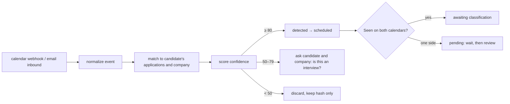

# 30 — Interview Tracking and Two-Sided Confirmation

**Service:** `tracking` · **Apps:** Jobs web, Hire web

## Purpose

Reliably know when an interview happened and **who brought the candidate**, because every price and payout depends on it. OpenSeat's answer is a record that neither side can bend alone: **two calendars witness the interview, both sides classify it, their incentives conflict, and the apply-click log breaks ties.**

## The rule the record enforces

| Classification | Meaning                                                              | Company pays | Seeker pays               | Scout earns                             |
| -------------- | -------------------------------------------------------------------- | ------------ | ------------------------- | --------------------------------------- |
| **internal**   | Candidate applied via the company's own OpenSeat link or career page | **$5**       | **$2** after free credits | —                                       |
| **external**   | Candidate found the job via OpenSeat Jobs or Scout                   | **$20**      | **$0**                    | **$1** on first interview, scouted jobs |

Only interview numbers **1–3** for a `(candidate, job)` are billable; from the 4th, nobody pays. Only **registered companies** owe fees.

## Why it holds

1. **Two calendars are the witness.** Every user connects Google or Outlook. An interview shows on the candidate's and the interviewer's calendars, even if booked outside OpenSeat.
2. **Both sides classify it.** After the date, the candidate and the company each mark the interview `internal`, `external` or `not_interview`.
3. **Incentives collide.** The company prefers internal ($5, not $20). The seeker prefers external ($0, not $2). Neither can misreport without the other objecting, so honest answers agree.
4. **The log breaks ties.** The apply click writes an immutable **source stamp** ([20](20-hire-ats.md)). If the answers differ, the stamp decides. Repeat mismatches are flagged per account.
5. **No fee, no next stage.** An interview whose fee is not authorized locks the candidate's next ATS stage.

## Signal sources

| Source                     | How                                                                | Strength                            | Required?                                    |
| -------------------------- | ------------------------------------------------------------------ | ----------------------------------- | -------------------------------------------- |
| **Calendar connection**    | Google Calendar / Microsoft Graph, event scope, push notifications | Strong; proves the event and timing | **Every user** (candidates and interviewers) |
| **On-platform scheduling** | Company schedules in the ATS                                       | Strongest                           | Default for Hire companies                   |
| **Email forwarding**       | Auto-forward job mail to a private address `u-<token>@in.<domain>` | Medium; catches phone screens       | Backup when a calendar is not possible       |
| **Manual + evidence**      | Candidate or company reports with screenshot                       | Weak                                | Fallback; billed as internal until resolved  |

An interview seen on only one calendar stays `pending` until the other side is seen, classifies, or the review window ends (below).

## Detection pipeline



### Normalization

Extract: organizer email/domain, attendee domains, title, description text, start/end, conferencing link, cancellation status, provider event ID. For email: sender, subject, body, ICS attachments, scheduling links (Calendly, GoodTime, Gem, Greenhouse/Ashby/Lever scheduling).

### Matching

Candidate's open applications (last 120 days) and company jobs → match by organizer/attendee domain ∈ company domains, company or job title in title/body, time proximity after the application, and the interview number is incremented per `(candidate, job)` chronologically.

### Confidence score (0–100)

| Signal                                                                | Points |
| --------------------------------------------------------------------- | ------ |
| Organizer from company domain and candidate is an attendee            | +40    |
| Known ATS/scheduler sender + company name present                     | +35    |
| Event on **both** the candidate's and an interviewer's calendar       | +20    |
| "interview", "screen", "chat with", round keywords in title           | +15    |
| Video link present                                                    | +5     |
| Event created by the candidate themself (no external organizer)       | −30    |
| Matches exactly one open application                                  | +10    |
| Duplicate of an existing interview event (same job, overlapping time) | merge  |

## Classification and confirmation

- After `scheduled_end`, both sides get a one-tap prompt: **internal / external / not an interview**, plus _did it happen?_ (yes / cancelled / no-show).
- **Both agree** → `confirmed` with that classification (`resolved_by = agreement`).
- **They disagree** → the **source stamp** decides (`resolved_by = source_stamp`), both sides are told, and either may dispute. No stamp (applied off-platform) → default `internal`.
- **One side silent** for the window (config, default 72 h) → the other side's answer stands if it matches the stamp; otherwise the stamp decides.
- **Not an interview** by either side → moderator review only if the other side says it was.
- On-platform interviews confirm from attendance and only the classification step remains.
- On confirm: `interview.confirmed` → fee authorization; status `held` until `hold_until` (interview date + hold period, default 7 days) then `settled`.

### Registered vs unregistered companies

- If the company is **not registered**, the interview is still tracked and classified (so a fair history exists), but **nothing is owed and no fee is authorized**. Interviews before registration are not back-billed. Registration is prompted with the company's interview count.
- A company registering triggers `company.registered`; from then on new interviews are billable.

## No fee, no next stage

- `interview.confirmed` → `payments` authorizes the fee → `interview.fee_authorized` (unlock) or `interview.fee_failed` (`stage_locked = true` in the ATS).
- The candidate is never asked to pay the company's fee; a lock affects only the company's ability to advance that candidate.

## Disputes

Either party may dispute during the hold: the candidate (_wasn't an interview_, _wrong classification_), the company (_candidate didn't attend_, _wrong classification_), a scout (_bonus withheld_, only via support). Disputes open a moderation case with all evidence (both calendars, stamp, classification history); outcome `settled` or `voided`; money follows the outcome. See [32-trust-and-safety.md](32-trust-and-safety.md).

## Off-platform and hidden-interview detection

Flag for review when: a company's calendar shows repeated meetings with an OpenSeat candidate that never appear as interviews on OpenSeat; a candidate's calendar disconnects shortly after a high-confidence detection; an application moves to `offer` without a confirmed interview; a company's internal-vs-external classifications repeatedly contradict the stamps.

## Privacy

- Minimum scopes: Google `calendar.events.readonly` (or narrower), Microsoft `Calendars.Read`. No write scope unless the user enables scheduling help (separate consent).
- Process only events that match a company/job/application on OpenSeat; drop the rest immediately after matching (keep a salted hash for dedupe only).
- Show the user every detected item and its source; allow disconnect and deletion. (Disconnecting keeps existing records but removes the calendar witness, and future interviews cannot be verified.)
- Google OAuth verification and Microsoft publisher verification are required before public launch.

## API

```
POST   /v1/tracking/calendar/connect        {provider} -> oauth url
DELETE /v1/tracking/calendar/{id}
POST   /v1/tracking/email-forward           -> {forward_address, setup_instructions}
POST   /v1/webhooks/calendar/google         POST /v1/webhooks/calendar/microsoft
POST   /v1/webhooks/email/inbound           (provider inbound parse, signed)
GET    /v1/me/interviews?status=
POST   /v1/interviews/{id}/classify         {classification: internal|external|not_interview, happened?: bool}
POST   /v1/interviews/manual                {application_id, start, evidence_key}
POST   /v1/interviews/{id}/dispute          {reason, evidence_keys[]}
```

## Events

`interview.detected`, `interview.scheduled`, `interview.classified`, `interview.confirmed`, `interview.fee_authorized`, `interview.fee_failed`, `interview.no_show`, `interview.cancelled`, `interview.disputed`, `interview.settled`, `interview.voided`, `tracking.disconnected`.

## Background jobs

- Calendar channel renewal (Google channels expire; renew before expiry).
- Delta sync every 15 min as backup to webhooks.
- Classification prompts at `scheduled_end + 1h`; reminder at +24 h; tie-break at +72 h (rules above).
- Settlement job hourly: `fee_authorized` → `settled` when `hold_until` passes with no open dispute.

## Acceptance criteria

- A Greenhouse scheduling invite from the company's domain for an applied job is detected within 5 minutes and linked to the right application.
- Candidate says `external`, company says `internal` → the interview resolves by the source stamp and both sides are notified.
- An event the candidate created themself with no external organizer never auto-confirms.
- An interview with `interview_number` ≥ 4 confirms with a $0 fee on both sides.
- An unregistered company's interviews create no fee authorization.
- Unrelated calendar events are never stored beyond a salted hash.
- Settled interviews emit exactly one `interview.settled` (idempotent).
