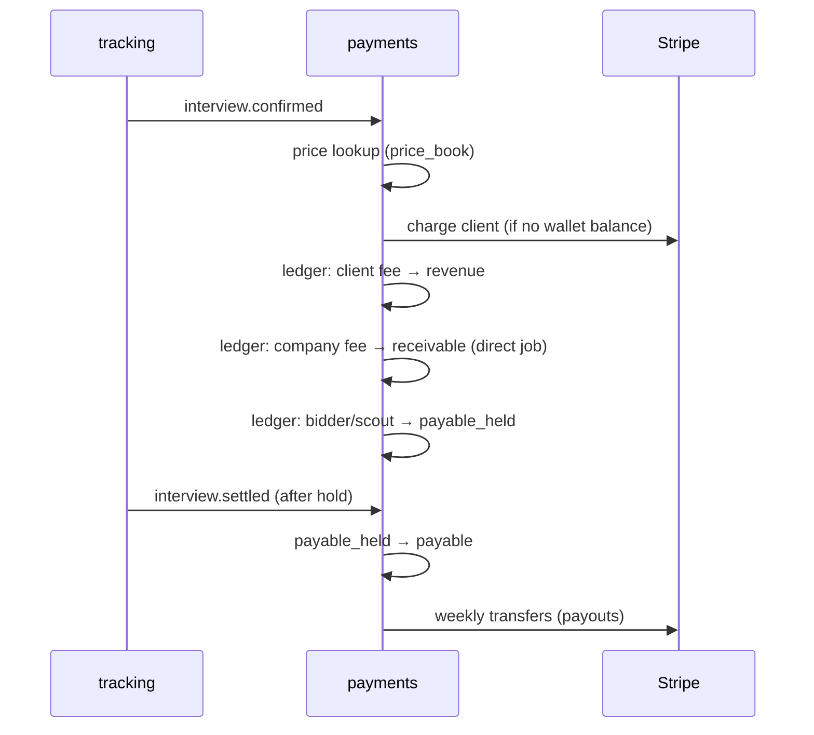

# 31 — Payments, Wallet, Escrow and Payouts

**Service:** `payments` (restricted ownership) · **Rail:** Stripe (Billing for charges, Connect for payouts)

## Purpose

Move money correctly for four payer/payee types (clients, companies, bidders, scouts) based on confirmed interviews and plans, with an auditable internal ledger.

## Principles

- **Our double-entry ledger is the source of truth.** Stripe is the payment rail; reconcile daily.
- Integer cents; one currency per ledger account; FX handled at charge time.
- Append-only: corrections are new reversing transactions, never edits.
- Every money-creating operation takes an `Idempotency-Key` and a `reference_type/reference_id` (e.g. `interview_event/<id>`), unique per transaction type.
- Prices come from versioned `price_books` — never hard-coded.

## Accounts

| Account | Owner | Purpose |
|---|---|---|
| `client:wallet` | client | Prepaid balance / plan credits |
| `client:escrow` | client (held by platform) | Funds reserved for an engagement |
| `company:receivable` | company | Interview fees owed (invoiced monthly or charged per event) |
| `bidder:payable_held` → `bidder:payable` | bidder | Earnings in hold, then releasable |
| `scout:payable_held` → `scout:payable` | scout | Rewards in hold, then releasable |
| `platform:revenue:*` | platform | By stream: client_interview, company_interview, plan, take_rate |
| `platform:cost:*` | platform | piece_rate, scout_rewards, idv, agent_compute (cost tracking) |
| `stripe:clearing` | platform | Cash in/out through Stripe |

## Flows

### 1. Client plan subscription
Stripe Billing subscription → on `invoice.paid`: debit `stripe:clearing`, credit `platform:revenue:plan` (or `client:wallet` for credit-based plans).

### 2. Client per-interview fee (on `interview.confirmed`)
- Charge `client_interview` price (price book; proposed **$4**, see [50-pricing-and-revenue.md](50-pricing-and-revenue.md)).
- If wallet/escrow balance covers it: debit `client:wallet`, credit `platform:revenue:client_interview`.
- Else charge card on file (off-session) → via `stripe:clearing`.
- On dispute voided → reversing transaction and refund.

### 3. Company per-interview fee (direct jobs, on `interview.confirmed` with attendance)
- Price by seniority/round (price book; proposed **$30** flat to start, cap 3 rounds per candidate per job).
- Skip if within free-interview allowance (new claims: first 10).
- Accrue to `company:receivable`; monthly invoice (Free/Growth) or per-event charge (config). Respect monthly spend cap.

### 4. Bidder earnings
- **Piece rate (managed):** on `application.qa_passed` → debit `platform:cost:piece_rate`, credit `bidder:payable_held` (Phase 1: $0.05/bid). Release weekly.
- **Marketplace:** base fee from client escrow released weekly for delivered qualified applications; per-interview fee on `interview.confirmed` → `bidder:payable_held`, released on `interview.settled`. Platform fee by level is credited to `platform:revenue:take_rate`.

### 5. Scout rewards
On `interview.settled` for a scouted job → debit `platform:cost:scout_rewards`, credit `scout:payable_held`; release after scout hold (14 days). Conversion rewards computed monthly from the company's paid interviews.

### 6. Payouts
- Weekly batch: for each payee with `payable ≥ $25` and verified payout account (Stripe Connect Express) and tax info → create transfer, move `payable → stripe:clearing`.
- Payout blocked if: account restricted, open fraud flag, or risk ≥ 60.



## Refunds and reversals

| Case | Action |
|---|---|
| Interview voided after dispute | Reverse client and company fees; reverse held bidder/scout amounts |
| No-show confirmed | No company fee; client fee per policy (default: no charge) |
| Payout already made and later voided | Negative balance on payee; recovered from future earnings; repeated → trust case |
| Chargeback | Freeze client account; reverse; trust case |

## Pro guarantee

Human Pro clients with tracking connected who get **zero confirmed interviews in the first 30 days** receive a credit (default 50% of base fee) to their wallet. Implemented as a scheduled check per engagement.

## API

```
GET  /v1/me/wallet                      -> balances by account kind
POST /v1/me/wallet/top-up               {amount_cents} -> checkout session
GET  /v1/me/transactions?cursor=
GET  /v1/me/payouts                     POST /v1/me/payout-account (Stripe onboarding link)
GET  /v1/companies/{id}/invoices
POST /v1/webhooks/stripe                (signed; idempotent by event id)
GET  /v1/admin/ledger/reconciliation?date=
POST /v1/admin/adjustments              {account, amount, reason}   (dual approval required)
```

## Background jobs

- `payments.settle` hourly (hold → payable)
- `payments.payouts` weekly (Monday 09:00 UTC)
- `payments.invoices` monthly
- `payments.reconcile` daily: Stripe balance transactions ↔ ledger; mismatches open an alert
- `payments.guarantee` daily

## Acceptance criteria

- Replaying the same `interview.confirmed` event 5 times creates exactly one set of ledger transactions.
- Sum of all ledger entries is zero at all times (checked in CI against a seeded scenario and nightly in prod).
- A company with a $500 cap is never charged above $500 in a month.
- Payouts never include amounts still in hold.
- Every manual adjustment has two distinct admin approvals and an audit log entry.
