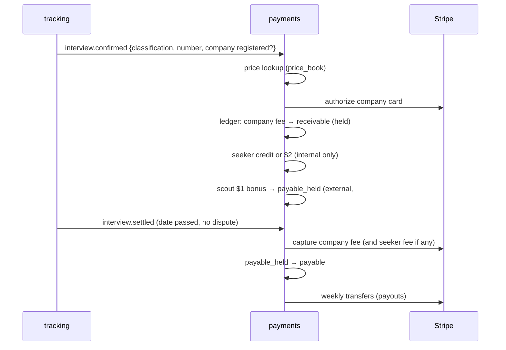

# 31 — Payments, Credits, Fees and Payouts

**Service:** `payments` (restricted ownership) · **Rail:** Stripe (Billing for subscriptions and cards, Connect for payouts)

## Purpose

Move money correctly for three parties (companies, seekers, scouts) based on confirmed interviews and subscriptions, with an auditable internal ledger.

## Principles

- **Our double-entry ledger is the source of truth.** Stripe is the payment rail; reconcile daily.
- Integer cents; one currency per ledger account; FX handled at charge time.
- Append-only: corrections are new reversing transactions, never edits.
- Every money-creating operation takes an `Idempotency-Key` and a `reference_type/reference_id` (e.g. `interview_event/<id>`), unique per transaction type.
- Prices come from versioned `price_books` — never hard-coded.
- **Fees are per interview, per candidate, per job; billable only for interview numbers 1–3; only for registered companies.**

## Accounts

| Account                                | Owner    | Purpose                                                         |
| -------------------------------------- | -------- | --------------------------------------------------------------- |
| `seeker:wallet`                        | seeker   | Card on file, Premium billing, interview credits (non-monetary) |
| `company:receivable`                   | company  | Interview fees authorized/owed                                  |
| `scout:payable_held` → `scout:payable` | scout    | Rewards in hold, then releasable                                |
| `platform:revenue:*`                   | platform | By stream: premium, company_interview, seeker_interview         |
| `platform:cost:*`                      | platform | scout_pool, scout_bonus, assistant_compute, idv, payment_fees   |
| `stripe:clearing`                      | platform | Cash in/out through Stripe                                      |

## Flows

### 1. Premium subscription ($20/mo)

Stripe Billing subscription → on `invoice.paid`: debit `stripe:clearing`, credit `platform:revenue:premium`. The **scout pool** is then accrued: 20% of the payment moves to `platform:cost:scout_pool` and is allocated at month end across the distinct hidden jobs that user applied to that month ([13](13-scout-mode.md)). If the user applied to no hidden job, the pool amount stays as platform revenue.

### 2. Company interview fee (on `interview.confirmed`)

- Skip if company not registered, interview number ≥ 4, or classification is `not_interview`.
- Price from price book: **$5** if `internal`, **$20** if `external`.
- **Authorize** the company's card (hold) → `interview.fee_authorized`; on failure → `interview.fee_failed` (stage lock, retry schedule).
- Accrue to `company:receivable`; **capture on settlement** (`interview.settled`) after the interview date and hold with no open dispute.
- No free credits or free-first-interviews for companies.

### 3. Seeker interview fee (internal interviews only)

- Skip if classification is `external` (**$0**), interview number ≥ 4, or the company is not registered.
- If the seeker has credits left this month (3–5 granted, config): consume one credit, charge **$0**.
- Else charge **$2** to the card on file at settlement.

### 4. Scout rewards

- **Interview bonus:** on `interview.settled` where classification is external, interview number is 1, and the job is scouted → debit `platform:cost:scout_bonus`, credit `scout:payable_held` **$1**.
- **Pool share:** month-end allocation credited to `scout:payable_held` ([13](13-scout-mode.md)).
- **Conversion bonus:** when a scouted company registers and its first fee settles.
- Release after the scout hold (default 14 days).

### 5. Payouts

- Weekly batch: for each scout with `payable ≥ $25`, a verified payout account (Stripe Connect Express) and tax info → create transfer, move `payable → stripe:clearing`.
- Payout blocked if: account restricted, open fraud flag, or risk ≥ 60.



## Refunds and reversals

| Case                                 | Action                                                                                    |
| ------------------------------------ | ----------------------------------------------------------------------------------------- |
| Interview voided after dispute       | Release the authorization or refund; reverse seeker fee and credit; reverse scout amounts |
| Candidate no-show / cancelled        | No company fee, no seeker fee; credit restored                                            |
| Reclassified after dispute           | Re-price ($5↔$20), adjust seeker fee, and reverse or add the scout bonus                  |
| Bot application found                | Void any unsettled fee tied to that application                                           |
| Payout already made and later voided | Negative balance on payee; recovered from future earnings; repeated → trust case          |
| Chargeback                           | Freeze the payer account; reverse; trust case                                             |

## API

```
GET  /v1/me/wallet                      -> premium status, credits, payment method, transactions
POST /v1/me/payment-method              (Stripe SetupIntent)
GET  /v1/me/transactions?cursor=
GET  /v1/me/payouts                     POST /v1/me/payout-account (Stripe onboarding link)
GET  /v1/companies/{id}/invoices
POST /v1/webhooks/stripe                (signed; idempotent by event id)
GET  /v1/admin/ledger/reconciliation?date=
POST /v1/admin/adjustments              {account, amount, reason}   (dual approval required)
```

## Background jobs

- `payments.settle` hourly (authorized → captured, held → payable)
- `payments.retry_authorizations` (failed fee authorizations, backoff)
- `payments.scout_pool` monthly (allocate Premium 20% pool)
- `payments.credits.grant` monthly (seeker free credits)
- `payments.payouts` weekly (Monday 09:00 UTC)
- `payments.invoices` monthly (per-company summary of fees)
- `payments.reconcile` daily: Stripe balance transactions ↔ ledger; mismatches open an alert

## Acceptance criteria

- Replaying the same `interview.confirmed` event 5 times creates exactly one set of ledger transactions.
- Sum of all ledger entries is zero at all times (checked in CI against a seeded scenario and nightly in prod).
- An internal interview yields a $5 company fee; an external one $20; the 4th interview for the same candidate and job yields $0 on both sides.
- An external interview never charges the seeker; an internal interview charges $2 only after credits are used.
- Company fees are captured only after the interview date passes with no dispute.
- Payouts never include amounts still in hold.
- Every manual adjustment has two distinct admin approvals and an audit log entry.
