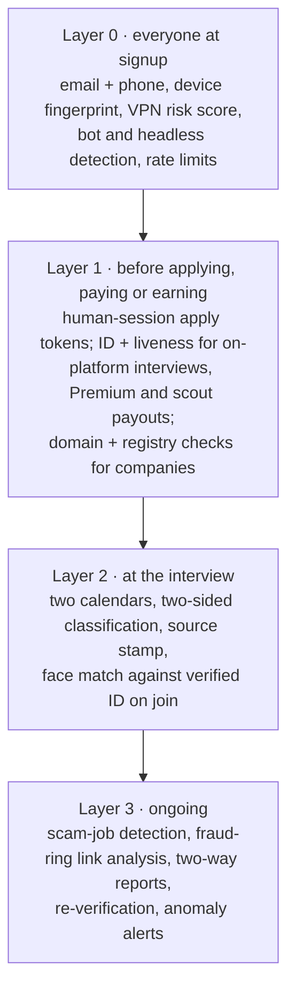

# 32 — Trust and Safety

**Service:** `trust` · **App:** `admin-web` (moderation queues)

## Purpose

Keep fake jobs, fake candidates, proxy interviews, spam applications, and payout fraud out — without punishing honest users.



## Threats and controls

| Threat                                     | Controls                                                                                                                                                          |
| ------------------------------------------ | ----------------------------------------------------------------------------------------------------------------------------------------------------------------- |
| **Bot and delegated applications**         | Human-session apply tokens, no apply API, automation detection, step-up challenge, rate limits, company `suspected_bot` reports ([22](22-no-bot-applications.md)) |
| Fake/scam job posts                        | Company verification, scout auto checks, scam-text classifier (payment requests, off-platform chat apps, crypto, too-good salary), domain age, two-way reports    |
| Fake candidates / stolen identity          | Tier 2 ID + liveness before on-platform interviews and Premium; face-duplicate check                                                                              |
| Proxy / deepfake interviews                | Face check at join for on-platform interviews; company "identity mismatch" report with evidence                                                                   |
| **Fee avoidance: off-platform interviews** | Required calendars on both sides, hidden-interview heuristics, stage lock ("no fee, no next stage") ([30](30-interview-tracking.md))                              |
| **Fee avoidance: relabeling**              | Both sides classify; incentives conflict; the first-touch **source stamp** breaks ties; repeat mismatches flagged per account                                     |
| Fake interviews (to earn a scout bonus)    | Two-calendar witness, confidence scoring, settlement holds, disputes, link analysis                                                                               |
| Collusion (scout ↔ candidate)              | Link graph over devices, IPs, payout accounts, payment methods, phones; blocked pairings; earnings voided                                                         |
| Fabricated resumes                         | Candidate-authored only; company scorecards and reports                                                                                                           |
| Scraping / API abuse                       | Risk scoring, rate limits, headless detection, CAPTCHA on high risk                                                                                               |
| Recording misuse (AI assistant)            | Consent from all participants, visible indicator, retention limits, access logs ([21](21-hire-ai-interview-assistant.md))                                         |

## Reports (two-way)

- Anyone can report: companies report candidates; candidates report companies/jobs; scouts and staff report scouts.
- **Objective reason codes only:** `no_show`, `identity_mismatch`, `proxy_interviewer`, `fake_credentials`, `abusive_behavior`, `scam_job`, `fake_company`, `suspected_bot`, `misclassified_interview`, `payment_request`, `other_with_evidence`. "Not a good fit" is **never** a report.
- **Reporter weight** = f(reporter's historical upheld rate, report volume relative to peers). A company reporting 50% of candidates has low weight.
- Subject is notified with the reason code and can respond/appeal within 7 days.
- Only **upheld** reports affect standing; effects decay (half-life 180 days).
- **No public negative score on job seekers.** Upheld reports lower visibility or require re-verification internally. Public signals are positive only ("Identity verified", "Attended 8 of 8 interviews").

## Link analysis

`link_edges` connect accounts sharing: device fingerprint, IP /24 within 7 days, payout account, payment method, phone. Rules:

- A scout never earns a pool share or interview bonus where the applying candidate is linked to them.
- A company and a candidate linked by device, payout or payment method cannot have billable interviews together (flagged for review).
- Clusters with ≥ 3 accounts and money flowing inside the cluster → fraud case.

## Rule engine

Declarative rules evaluated on events; output: `fraud_flags` with score and evidence. Examples:

- `R-IV-01` interview confirmed < 2 h after application submit → review.
- `R-IV-02` candidate has > 10 interviews/week with < 50 applications → review.
- `R-CL-01` a company's classification contradicts the source stamp in > 10% of interviews (min 10) → flag company, review.
- `R-CL-02` a candidate's classification contradicts the stamp in > 10% of interviews → flag candidate, review.
- `R-BOT-01` automation signal on an apply attempt → block apply, write detection ([22](22-no-bot-applications.md)).
- `R-BOT-02` > N applications per hour from one device or account → cooldown.
- `R-SC-01` scout submission approval rate < 60% in 7 days → demote + review.
- `R-PAY-01` payout account change + payout request within 24 h → hold payout 72 h.

## Moderation queues (admin-web)

`scout_review`, `company_verification`, `reports`, `disputes`, `classification_mismatches`, `automation_detections`, `fraud_flags`. Each case: evidence panel, linked accounts, history, decision buttons with required reason, SLA timer (default 48 h; disputes 5 business days).

## Enforcement ladder

Warning → apply cooldown/rate reduction → apply suspension → payout hold → suspension → ban (with face template on block list). Every step logged; bans for fraud or bot applications include clawback of unsettled earnings and withdrawal of automated applications.

## API

```
POST /v1/reports                    {subject_type, subject_id, reason_code, details, evidence_keys[]}
GET  /v1/me/reports                 (reports about me + appeals)
POST /v1/reports/{id}/appeal        {statement, evidence_keys[]}
GET  /v1/admin/cases?queue=&status=
POST /v1/admin/cases/{id}/decision  {decision, reason, actions[]}
```

## Events

`report.filed`, `report.upheld`, `report.dismissed`, `fraud.flagged`, `account.restricted`, `account.suspended`, `dispute.resolved`.

## Acceptance criteria

- A report with reason "not a good fit" cannot be submitted (not in the enum).
- A report with reason "suspected_bot" opens a case with the application's `human_attestation` and detection history.
- A scout linked by payout account to a candidate receives no pool share or bonus for that candidate's applications and interviews.
- Upheld report effects decay according to the half-life in the nightly recompute.
- Every moderation decision stores reviewer, reason, and evidence snapshot.
