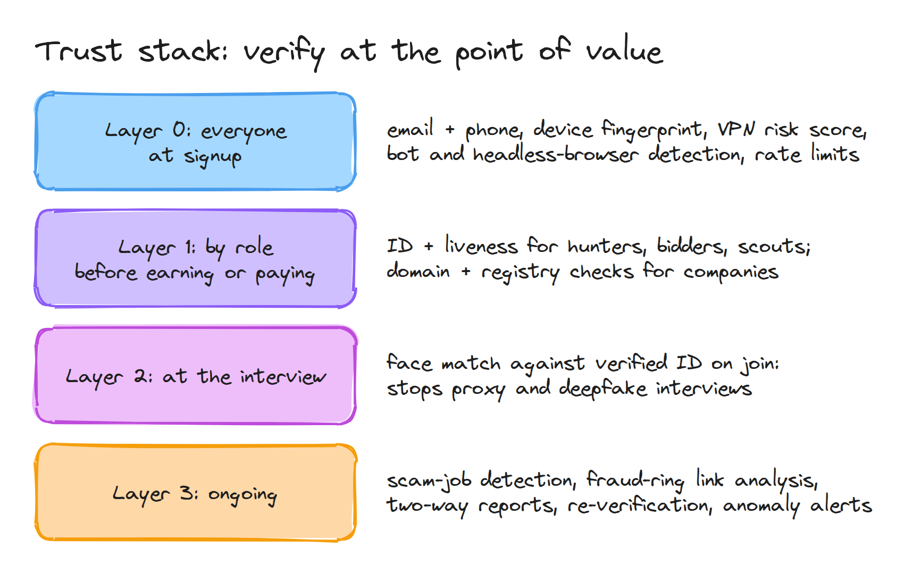

# 32 — Trust and Safety

**Service:** `trust` · **App:** `admin-web` (moderation queues)

## Purpose

Keep fake jobs, fake candidates, proxy interviews, spam applications, and payout fraud out — without punishing honest users.



## Threats and controls

| Threat                              | Controls                                                                                                                                                       |
| ----------------------------------- | -------------------------------------------------------------------------------------------------------------------------------------------------------------- |
| Fake/scam job posts                 | Company verification, scout auto checks, scam-text classifier (payment requests, off-platform chat apps, crypto, too-good salary), domain age, two-way reports |
| Fake candidates / stolen identity   | Tier 2 ID + liveness before interviews; face-duplicate check                                                                                                   |
| Proxy / deepfake interviews         | Face check at join for on-platform interviews; company "identity mismatch" report with evidence                                                                |
| Application spam                    | Fit thresholds, daily and per-company caps, quotas tied to interview rate and "not relevant" feedback, company per-job policy                                  |
| Fabricated resumes                  | Fabrication guard (agent), rules + QA sampling (humans), client approval of tailored versions                                                                  |
| Fake interviews (to earn)           | Company-side evidence, confidence scoring, holds, disputes, link analysis                                                                                      |
| Hidden interviews (to avoid fees)   | Required tracking on per-interview plans, hidden-interview heuristics ([30-interview-tracking.md](30-interview-tracking.md))                                   |
| Collusion (scout ↔ bidder ↔ client) | Link graph over devices, IPs, payout accounts, payment methods, phones; blocked pairings; earnings voided                                                      |
| Account sharing/selling (bidders)   | Periodic selfie re-verification, device changes trigger step-up                                                                                                |
| Bots/scraping                       | Risk scoring, rate limits, headless detection, CAPTCHA on high risk                                                                                            |

## Reports (two-way)

- Anyone can report: companies report candidates; candidates report companies/jobs; clients report bidders; bidders report clients.
- **Objective reason codes only:** `no_show`, `identity_mismatch`, `proxy_interviewer`, `fake_credentials`, `abusive_behavior`, `scam_job`, `fake_company`, `fabricated_application`, `payment_request`, `other_with_evidence`. "Not a good fit" is **never** a report.
- **Reporter weight** = f(reporter's historical upheld rate, report volume relative to peers). A company reporting 50% of candidates has low weight.
- Subject is notified with the reason code and can respond/appeal within 7 days.
- Only **upheld** reports affect standing; effects decay (half-life 180 days).
- **No public negative score on job seekers.** Upheld reports lower visibility or require re-verification internally. Public signals are positive only ("Identity verified", "Attended 8 of 8 interviews").

## Link analysis

`link_edges` connect accounts sharing: device fingerprint, IP /24 within 7 days, payout account, payment method, phone. Rules:

- A scout never earns on interviews where the client or bidder is linked.
- A bidder cannot work for a linked client.
- Clusters with ≥ 3 accounts and money flowing inside the cluster → fraud case.

## Rule engine

Declarative rules evaluated on events; output: `fraud_flags` with score and evidence. Examples:

- `R-IV-01` interview confirmed < 2 h after application submit → review.
- `R-IV-02` client confirms > 10 interviews/week with < 50 applications → review.
- `R-SC-01` scout submission approval rate < 60% in 7 days → demote + review.
- `R-BD-01` bidder "not relevant" rate > 10% over 50 apps → quota −50%, review.
- `R-PAY-01` payout account change + payout request within 24 h → hold payout 72 h.

## Moderation queues (admin-web)

`scout_review`, `company_verification`, `reports`, `disputes`, `fraud_flags`, `qa_sampling`. Each case: evidence panel, linked accounts, history, decision buttons with required reason, SLA timer (default 48 h; disputes 5 business days).

## Enforcement ladder

Warning → quota reduction → feature restriction → payout hold → suspension → ban (with face template on block list). Every step logged; bans for fraud include clawback of unsettled earnings.

## API

```
POST /v1/reports                    {subject_type, subject_id, reason_code, details, evidence_keys[]}
GET  /v1/me/reports                 (reports about me + appeals)
POST /v1/reports/{id}/appeal        {statement, evidence_keys[]}
GET  /v1/admin/cases?queue=&status=
POST /v1/admin/cases/{id}/decision  {decision, reason, actions[]}
```

## Events

`report.filed`, `report.upheld`, `report.dismissed`, `fraud.flagged`, `account.restricted`, `account.suspended`, `dispute.resolved`.

## Acceptance criteria

- A report with reason "not a good fit" cannot be submitted (not in the enum).
- A scout linked by payout account to a bidder receives no reward for that bidder's client interviews.
- Upheld report effects decay according to the half-life in the nightly recompute.
- Every moderation decision stores reviewer, reason, and evidence snapshot.
