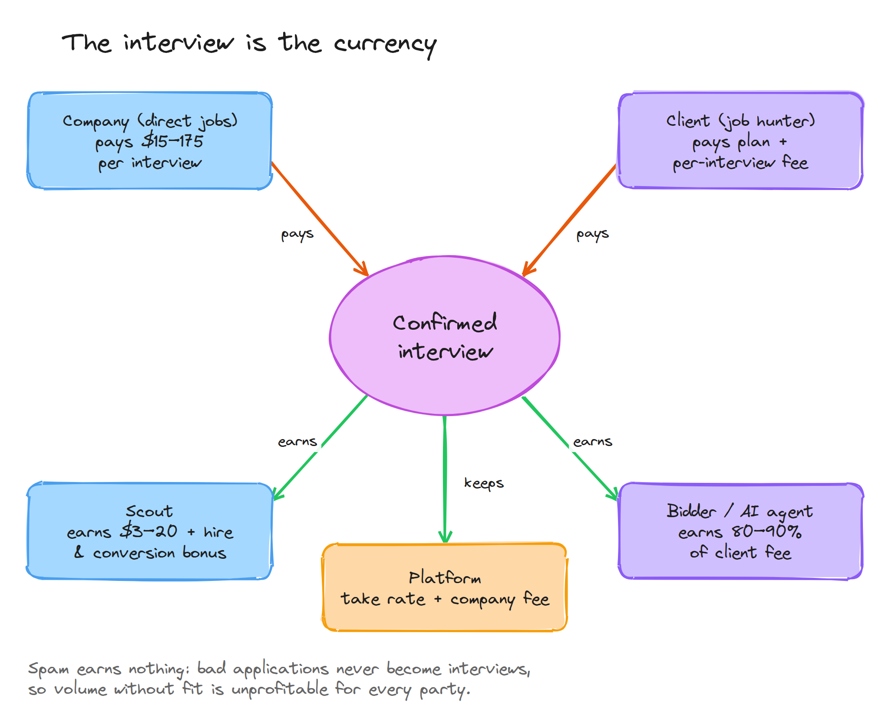

# 50 — Pricing and Revenue Model

All prices live in `price_books` (see [31-payments-wallet-escrow.md](31-payments-wallet-escrow.md)) so they can change without deploys. Values below are **v1 defaults**.

## Validated production numbers

From 3+ months in production with ~100 internal testers and job hunters **(validated)**:

| Channel                     | Volume                              | Interviews   | Interview rate | Cost basis         | Cost per interview |
| --------------------------- | ----------------------------------- | ------------ | -------------- | ------------------ | ------------------ |
| Human bidder (complex jobs) | ~70 apps/day (~490/week)            | ~5/week      | ~1.0%          | $0.05 per bid      | **~$4.90**         |
| AI agent (bulk ATS jobs)    | ~150 apps/day in ~1 h (~1,050/week) | ~5/week      | ~0.5%          | ~$0.50/day compute | **~$0.70**         |
| **Combined**                | ~1,540/week                         | **~10/week** | ~0.65%         |                    | **~$2.80**         |

Notes:

- The job hunter clicked submit even for AI-prepared applications.
- Quality control combined an automatic resume-upload check with manual bid recording; incorrect applications were rejected.
- Costs above are **direct labor/compute only**. Fully loaded cost per job (ID checks, payment fees, support, QA staff, infrastructure) is not yet measured — see [99-open-questions.md](99-open-questions.md).

## Principle

Free to join, free to post, free to search. **Pay and get paid per confirmed interview.** Quality earns capacity.

## Companies (direct jobs only)

**Proposed v1:** **$30 per interview round**, capped at 3 rounds per candidate per job **(assumption)**.

Alternative (price by seniority, for later testing):

| Role level           | Per interview |
| -------------------- | ------------- |
| Hourly / entry       | $15–25        |
| Mid-level            | $50–75        |
| Senior / specialized | $100–175      |
| Executive            | Custom        |

| Tier                 | Price              | Includes                                                                                                     |
| -------------------- | ------------------ | ------------------------------------------------------------------------------------------------------------ |
| Free (pay as you go) | $0 + per-interview | Unlimited posts, first 10 interviews free after claim, scheduling, fit scores, verified-candidate badges     |
| Growth               | ~$149–299 / month  | Interview credits at ~20–25% discount, assisted-application controls, featured placement, applicant tracking |
| Enterprise           | Custom             | Volume pricing, ATS integration, API, SSO, support                                                           |

Billing rules: billable only if scheduled on-platform **and** attended; no-show and > 24 h cancellations are free; monthly cap set by the company; reports never cancel fees; placement fee for off-platform hires within 12 months.

## Clients (job hunters on Connect)

**Proposed v1:** **$4 per confirmed interview** **(assumption)**, plus an optional plan.

| Plan                    | Price (assumption)                   | What                                                     |
| ----------------------- | ------------------------------------ | -------------------------------------------------------- |
| Free                    | $0                                   | Search, apply yourself, tracker, verified badge          |
| AI Basic                | ~$29 / month (+ $4 per interview)    | AI agent on bulk jobs, rules-based, client clicks submit |
| AI + Human              | ~$79 / month (+ $4 per interview)    | Agent for bulk + human bidders for complex forms         |
| Human Pro (marketplace) | Bidder's package + per-interview fee | Chosen bidder; 30-day interview guarantee credit         |

## Bidders

Two models are supported (decision pending):

|                               | Managed workforce (Phase 1)                         | Marketplace                                                      |
| ----------------------------- | --------------------------------------------------- | ---------------------------------------------------------------- |
| Pay                           | Piece rate, **$0.05 per QA-passed bid** (validated) | Bidder-set base + per-interview; platform fee 20% → 10% by level |
| Platform margin per interview | Very high (cost ~$4.90/interview)                   | ~10–20% of bidder revenue                                        |
| Scaling                       | Limited by hiring/managing workers                  | Self-serve supply                                                |

Worked marketplace example: base $200 + 6 interviews × $40 = $440 paid by the client; 17% fee = $75; bidder earns $365.

## Scouts

| Reward             | Amount (assumption)                                  | Trigger                              |
| ------------------ | ---------------------------------------------------- | ------------------------------------ |
| Approval           | $0 probation; small credit trusted+                  | Job approved                         |
| Interview          | $3–5 entry, $5–10 mid, $10–20 senior                 | Settled interview on the scout's job |
| Hire               | $25–100                                              | Confirmed hire                       |
| Company conversion | ~10% of that company's interview fees for 3–6 months | Company claims page and pays         |

## Unit economics per job (example, assumption)

Example job: 100 applicants from us, 20 unique candidates interviewed, 30 interview rounds total.

| Line                                           | Amount            |
| ---------------------------------------------- | ----------------- |
| Client fees: $4 × 20 candidates                | $80               |
| Company fees: $30 × 30 rounds                  | $900              |
| **Revenue**                                    | **$980**          |
| Direct labor (100 bids × $0.05)                | ~$5               |
| Fully loaded cost (placeholder until measured) | ~$300             |
| **Net (conservative / labor-only)**            | **~$680 / ~$975** |

⚠️ Decide whether the client fee is per **candidate** (as above, 20) or per **round** (30). Keep client and company definitions consistent unless there's a deliberate reason not to.

At 1,000 such jobs per year: ~$980k revenue, ~$680k–$975k net. Revenue is earned per interview, not per hire, so jobs that produce interviews but never fill still generate revenue.

**Company fees apply only to direct jobs.** For aggregated/scouted jobs, revenue is client-side only until the company claims its page. The per-job example therefore describes a **direct** job.

## Revenue streams (full platform)

| Stream                                               | Phase |
| ---------------------------------------------------- | ----- |
| Client plans + per-interview fees                    | Now   |
| Bidder take rate (marketplace)                       | 2     |
| Company pay-per-interview                            | 2–3   |
| Company Growth/Enterprise plans                      | 3     |
| Promoted jobs / employer branding (capped)           | 3     |
| Staffing agency plan                                 | 2–3   |
| Verified interview hosting (face-checked video)      | 3     |
| Reusable verified candidate credential               | 3+    |
| ATS partnerships / API                               | 2–3   |
| Interview prep add-on (before/after interviews only) | 2     |

## Metrics that decide pricing

1. Confirmed interviews per 100 applications (by channel)
2. Scouted-company claim/conversion rate
3. Company willingness to pay at the proposed price (test with 10–20 companies before billing ships)
4. Fully loaded cost per interview
