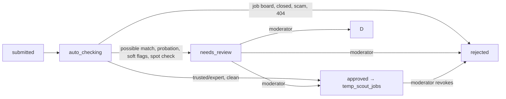

# 61 — Scout API (job submission protocol)

**Service:** `joined-backend` (`internal/scout`, `internal/httpapi/scout*.go`) · **Clients:** Scoutwell (`scoutwell-frontend`), outsourcing partners, admin console (`joined-admin`)

One protocol for every way a job enters the pool from a scout: the Scoutwell web form, a partner's sourcing pipeline, and bulk uploads all call the same endpoints and go through the same checks, levels, and rewards (see [13-platform-scout.md](13-platform-scout.md)). Conventions follow [60-api-conventions.md](60-api-conventions.md).

## Authentication

Every `/v1/scout/*` call except `GET /v1/scout/meta` needs `Authorization: Bearer <token>`. Two kinds of token work:

| Token                        | Who uses it                    | Can call                                                                                      |
| ---------------------------- | ------------------------------ | --------------------------------------------------------------------------------------------- |
| Session token (64 hex chars) | A signed-in person (Scoutwell) | Everything under `/v1/scout`                                                                  |
| API key (`scw_` + 48 hex)    | A partner's server             | `me` (read), `stats`, `companies`, `submissions/*`, `earnings`. Not keys, payouts, or profile |

- Keys are created and revoked in Scoutwell → **API access**. The secret is shown once; the API stores only its SHA-256.
- A key acts as the scout who created it: same level, daily limit, and rewards.
- The scout must have accepted the scout terms; otherwise every create answers `403 terms_required`.

## Endpoints

| Method | Path                                           | Purpose                                                                              |
| ------ | ---------------------------------------------- | ------------------------------------------------------------------------------------ |
| `GET`  | `/v1/scout/meta`                               | Levels, promotion rules, reward table, field limits, rejection reasons. Public.      |
| `GET`  | `/v1/scout/me`                                 | The scout profile (level, verification tier, payout setup).                          |
| `GET`  | `/v1/scout/stats`                              | Level, quality metrics, balance, today's quota, unread notifications.                |
| `GET`  | `/v1/scout/companies?q=`                       | Find a company already in the pool, to send its `company_id`.                        |
| `POST` | `/v1/scout/companies`                          | Create an unclaimed company (`{legal_name, url}` or multipart with `logo`).          |
| `POST` | `/v1/scout/submissions/precheck`               | `{url}` → reachable, official, still open. Stores nothing.                           |
| `POST` | `/v1/scout/submissions/matches`                | `{url, company_id?, company_name, title}` → existing jobs (link or company+title).   |
| `POST` | `/v1/scout/submissions`                        | Submit one job. `201` with the submission in status `submitted`.                     |
| `POST` | `/v1/scout/submissions/batch`                  | `{submissions: [...]}`, up to `limits.max_batch`. `207` with a result per item.      |
| `GET`  | `/v1/scout/submissions`                        | Newest first. Filters: `status`, `external_ref`, `updated_since`, `cursor`, `limit`. |
| `GET`  | `/v1/scout/submissions/{id}`                   | One submission with its check results and live usage.                                |
| `GET`  | `/v1/scout/earnings`                           | Reward lines. Filters: `status`, `submission_id`, `cursor`, `limit`.                 |
| `GET`  | `/v1/scout/payouts` · `POST`                   | Session only. List payouts / request one for the available balance.                  |
| `GET`  | `/v1/scout/notifications` · `POST …/read`      | Session only.                                                                        |
| `GET`  | `/v1/scout/api-keys` · `POST` · `DELETE /{id}` | Session only. Manage API keys.                                                       |

## Submission fields

| Field                     | Rule                                                                                                                                                                                           |
| ------------------------- | ---------------------------------------------------------------------------------------------------------------------------------------------------------------------------------------------- |
| `url`                     | Required. The posting on the employer's site or ATS. Job boards are rejected.                                                                                                                  |
| `company_name`, `title`   | Required. 2–120 / 2–160 characters.                                                                                                                                                            |
| `company_id`              | Optional. An id from `GET /v1/scout/companies`; otherwise the name is matched or a page created.                                                                                               |
| `summary`                 | Required. `limits.min_summary_chars`–`limits.max_summary_chars`, in the scout's own words.                                                                                                     |
| `location_text`           | Required. 2–120 characters.                                                                                                                                                                    |
| `pay`                     | Required unless `equity` is true. `{min, max, currency, period}` with both amounts above zero. `salary` like `"$120k - $150k a year"` is still parsed into `pay` when the amounts are omitted. |
| `equity`                  | `true` when the role is paid in equity. Salary is stored unset, and a salary sent with it is dropped.                                                                                          |
| `workplace`, `employment` | Required enums from `meta.limits`.                                                                                                                                                             |
| `seniority`               | Optional enum from `meta.limits`; inferred from the title when omitted.                                                                                                                        |
| `tags`, `skills`          | Not accepted. Staff analyze the description with AI, which generates the skills and sets the visa-sponsorship flag.                                                                            |
| `not_duplicate_claim`     | Required when matches exist. The scout claims this listing is distinct; staff review the claim.                                                                                                |
| `external_ref`            | Optional partner id, unique per scout. Reuse answers `409` with `existing_id`.                                                                                                                 |

## Lifecycle



- Checks run in the background, normally within seconds (60 s timeout, 2 retries; restarts resume unfinished checks).
- A submission is stored in `temp_scout_jobs` as soon as it is created. Staff analyze it from Admin → Scout jobs; that writes the search record into `jobs` with `source: "scoutwell"`. Approval does not publish it.
- A match on apply link or company+title is shown to the scout and stored on the submission. It never auto-sets status `duplicate`. The scout must send `not_duplicate_claim` when matches exist; staff then approve, reject, or mark duplicate.

## Staying in sync

Poll changes instead of each id:

```bash
curl "$API/v1/scout/submissions?updated_since=2026-09-28T09:00:00Z&limit=100" \
  -H "Authorization: Bearer $SCOUTWELL_KEY"
```

Follow `next_cursor` as `?cursor=` until it is empty.

## Idempotency and quotas

- Send `Idempotency-Key` on `POST /submissions` and `/submissions/batch`. The same key and body within 24 h replays the first response (`Idempotent-Replayed: true`); a different body answers `409 idempotency_key_reused`. Server errors are not cached.
- The daily limit comes from the scout's level and resets at midnight UTC. Creates return `RateLimit-Limit`, `RateLimit-Remaining`, and `RateLimit-Reset`; an exhausted quota answers `429 quota_exceeded` with `Retry-After`.

## Errors

RFC 9457 problem details (`application/problem+json`) with a stable `code`:

| Status | `code`                   | Meaning                                                  |
| ------ | ------------------------ | -------------------------------------------------------- |
| 400    | `invalid_request`        | Body is not valid JSON.                                  |
| 401    | `unauthorized`           | Missing, expired, unknown, or revoked token.             |
| 403    | `terms_required`         | Accept the scout terms in Scoutwell first.               |
| 403    | `forbidden`              | API keys cannot call this endpoint.                      |
| 409    | `conflict`               | `external_ref` reused (`existing_id`), or not decidable. |
| 409    | `idempotency_key_reused` | Same key, different body.                                |
| 422    | `validation_failed`      | `errors[]` lists `{field, detail}`.                      |
| 422    | `payout_blocked`         | Payout requirements are not met.                         |
| 429    | `quota_exceeded`         | Daily limit reached.                                     |

## Staff endpoints

`/v1/admin/scout/*` serves the admin console: overview counts, the review queue, per-submission detail (checks, scout record, related submissions, audit trail), decisions (`approve` with optional edits, `reject` with a reason code, `duplicate`), outcomes (`interview`, `hire`), `expire`, `recheck`, scout level and identity decisions, and payout decisions. When `ADMIN_API_TOKEN` is set on the API, these (and the older admin job and company endpoints) require it as a bearer token; the admin console adds it server-side through its `/api/joined` proxy so it never reaches a browser. Every staff decision is written to `admin_audit`.

## Data

Collections in the Joined database: `scout_profiles`, `scout_submissions`, `scout_earnings`, `scout_payouts`, `scout_notifications`, `scout_api_keys`, `scout_idempotency` (TTL 24 h), `admin_audit`. Tax ids and payout accounts are stored as the last four characters only.
