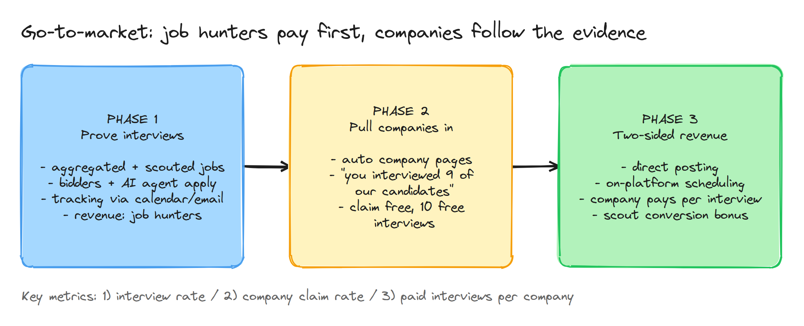

# 70 — Roadmap

## Where we are

- ✅ Job site live (job hunter + company modes, aggregation).
- ✅ **Phase 1 validated** (3+ months, ~100 internal users): human bidders + AI agent, split by form complexity, ~10 interviews/week per combined setup, job hunter clicks submit, hybrid QA.

## Build window (target: 2 months build, launch in month 3)

### Milestone A — Foundation (weeks 1–3)

- Monorepo + CI, api-gateway, shared types/events, outbox ([02-architecture.md](02-architecture.md))
- Identity: SSO across apps, modes, tier 1–2 verification, risk scoring v1, delegation agreements ([10](10-identity-and-accounts.md))
- Migrate Phase 1 data (clients, applications, bid logs) into the new schema ([03](03-data-model.md))
- Ledger + Stripe integration skeleton ([31](31-payments-wallet-escrow.md))

### Milestone B — Connect productized (weeks 3–6)

- Client onboarding, Jobs tab, top-N / shortlist / rules assignment, approvals, tracker ([20](20-connect-client.md))
- Bidder workspace with automated bid logs, resume-upload check, QA sampling, piece-rate earnings ([21](21-connect-bidder.md))
- AI agent: orchestrator, Greenhouse + Ashby + Lever adapters, fabrication guard, extension submit handoff ([22](22-ai-agent.md))
- Router bulk vs complex ([14](14-job-pool-and-matching.md))
- Interview tracking: calendar (Google, Microsoft) + email forwarding, confirmation, holds ([30](30-interview-tracking.md))
- Client per-interview billing + plans; weekly payouts ([31](31-payments-wallet-escrow.md))

### Milestone C — Trust + admin (weeks 5–8)

- Reports, rule engine v1, link analysis, moderation queues ([32](32-trust-and-safety.md), [40](40-admin-console.md))
- Notifications and messaging ([33](33-messaging-and-notifications.md))
- Legal review: terms, delegation agreement, privacy, report system ([90](90-compliance-privacy-security.md))
- OAuth verification (Google/Microsoft) submitted early — it gates public launch

### Launch (month 3) — controlled external cohort

- External clients in **one niche** (industry/region) + vetted bidders.
- Publish interview-rate results.

## Phase 2 — Pull companies in (months 4–6)

- Scout mode with auto checks and levels ([13](13-platform-scout.md))
- Auto-generated company pages with activity stats; claim flow ([12](12-platform-company.md))
- Evidence-based company outreach; staffing agency pilot
- On-platform scheduling + face check (free for claimed companies)
- ATS job-board partner programs → more direct jobs

## Phase 3 — Two-sided revenue (months 6–12)

- Company pay-per-interview billing, Growth plan, spend caps
- Scout conversion rewards
- Bidder marketplace model (if chosen) with levels and take rate
- Second niche expansion
- Verified interview hosting, Enterprise tier, public API

## Later

- Reusable verified candidate credential
- Interview prep add-on (before/after interviews)
- More ATS adapters for the agent; learning-based routing
