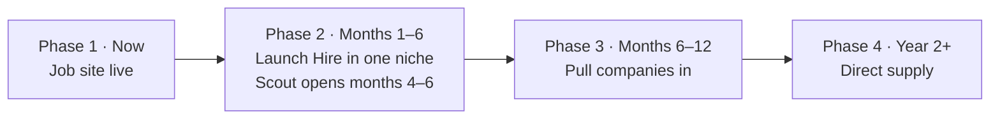

# 70 — Roadmap

Go-to-market: **win seekers first, then companies.** Companies register only after they have seen our candidates in their own interview loops.

## Where we are (September 2026)

- ✅ **Jobs is live:** job search for seekers and job posting for companies, with a large aggregated job pool.
- ✅ **Scout is built** (Scoutwell, scout API, admin review queue): [13](13-scout-mode.md), [61](61-scout-api.md). Rewards are recorded by staff until interview tracking emits `interview.settled`.
- 🚧 **Hire (ATS + AI interview assistant)** is next: build in 2 months, launch in month 3.
- ⛔ **Connect (bidders and AI auto-apply) is retired.** The earlier Phase 1 experiment is not part of the product; applications are human-only ([22](22-no-bot-applications.md)).

## Phase 1 — Now: job site live

OpenSeat Jobs runs today with job seekers, companies and a large job pool. Migrate existing job-site accounts to the new identity model without re-registration ([10](10-identity-and-accounts.md)).

## Phase 2 — Months 1–6: launch Hire in one niche

### Build window (2 months)

**Milestone A — Foundation (weeks 1–3)**

- Identity: SSO across apps, roles, tier 1–2 verification, risk scoring v1, automation detection ([10](10-identity-and-accounts.md), [22](22-no-bot-applications.md))
- Source stamps and the apply-token flow on candidate apply ([20](20-hire-ats.md))
- Ledger + Stripe skeleton: company card authorization, Premium subscription ([31](31-payments-wallet-escrow.md))
- Monorepo, CI, api-gateway, shared types/events, outbox ([02](02-architecture.md))

**Milestone B — Hire (weeks 3–7)**

- ATS: job posts, career page and company apply link, pipeline, stages, scorecards, offers ([20](20-hire-ats.md))
- Calendar connections (Google, Outlook) for every user; detection; two-sided classification; source-stamp tie-break ([30](30-interview-tracking.md))
- Fee authorization, settlement, stage lock; seeker free credits and $2 fee ([31](31-payments-wallet-escrow.md))
- AI interview assistant: recording consent, transcript, analysis, HR notes ([21](21-hire-ai-interview-assistant.md))

**Milestone C — Trust + admin (weeks 5–8)**

- Reports, rule engine v1 (classification mismatch, bot rules), link analysis, moderation queues ([32](32-trust-and-safety.md), [40](40-admin-console.md))
- Notifications and messaging ([33](33-messaging-and-notifications.md))
- Legal review: terms per role, recording consent, AI-in-hiring, fees ([90](90-compliance-privacy-security.md))
- Google/Microsoft OAuth verification submitted early — it gates public launch

### Launch (month 3)

- Launch **Hire in one niche**: companies already posting on Jobs move their hiring in.
- Publish interview rates.

### Months 4–6: Scout opens

- Scout opens to the public; Premium ($20/mo) seekers see hidden jobs first ([13](13-scout-mode.md)).
- Automate the scout economics: interview bonus ($1) and Premium pool allocation.
- Scouts add whole career pages and ATS boards so supply compounds.

## Phase 3 — Months 6–12: pull companies in

- Company pages show how many OpenSeat candidates the company interviewed ([12](12-hire-company-mode.md)).
- Company claims the page, registers, and pays $20 per found candidate and $5 per own applicant.
- Company conversion bonus for scouts.
- Second niche.

## Phase 4 — Year 2+: direct supply

- Direct posts replace aggregated jobs; per-source kill switch and under 20% of interviews from third-party boards before scaling.
- Enterprise plans, API and verified interview hosting.

## Milestones for the first 18 months (targets, to confirm)

- Hire launched in the first niche in month 3.
- 1,000 Premium seekers and a published interview rate.
- First 30 paying companies.
- Every interview confirmed from two calendars.
- About $0.8M revenue in Year 1 (base).

Key metrics: interview rate, company registration rate, paid interviews per company ([80](80-metrics-and-analytics.md)).
