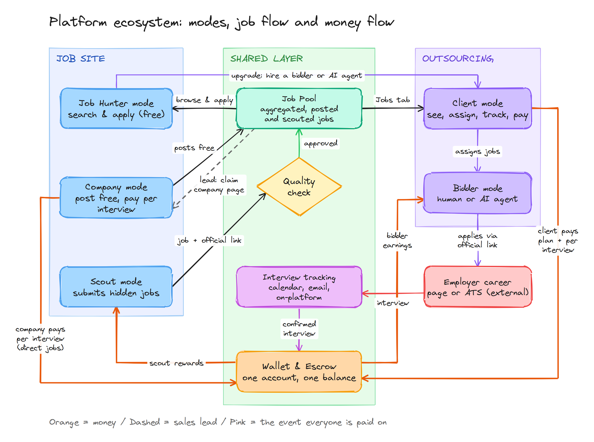

# Project Documentation

This folder is the source of truth for **what the product must do** and **how it is built**. Each file covers one service or module and is written so an engineer (or an AI coding agent) can implement that part without reading the whole set.

> **Product names are not final.** Throughout these docs:
> - **Job Platform** (code name `platform`) = Service 1, the free job site (job hunters, companies, scouts).
> - **Connect** (code name `connect`) = Service 2, the paid service where job hunters (clients) hire human bidders or the AI agent to apply for them.
>
> Replace the names once branding is decided. See [99-open-questions.md](99-open-questions.md).

## How to read these docs

| If you are building… | Start with |
|---|---|
| Anything | [00-product-overview.md](00-product-overview.md), [01-glossary.md](01-glossary.md) |
| Repo, infra, service boundaries | [02-architecture.md](02-architecture.md), [60-api-conventions.md](60-api-conventions.md) |
| Database schema | [03-data-model.md](03-data-model.md) |
| Login, accounts, verification | [10-identity-and-accounts.md](10-identity-and-accounts.md) |
| Job hunter pages | [11-platform-job-hunter.md](11-platform-job-hunter.md) |
| Company pages | [12-platform-company.md](12-platform-company.md) |
| Scout submissions | [13-platform-scout.md](13-platform-scout.md) |
| Job ingestion, search, matching | [14-job-pool-and-matching.md](14-job-pool-and-matching.md) |
| Client (hire a bidder) flows | [20-connect-client.md](20-connect-client.md) |
| Human bidder workspace | [21-connect-bidder.md](21-connect-bidder.md) |
| AI auto-bid agent | [22-ai-agent.md](22-ai-agent.md) |
| Interview detection and confirmation | [30-interview-tracking.md](30-interview-tracking.md) |
| Wallet, escrow, billing, payouts | [31-payments-wallet-escrow.md](31-payments-wallet-escrow.md) |
| Reports, fraud, moderation | [32-trust-and-safety.md](32-trust-and-safety.md) |
| Messages and notifications | [33-messaging-and-notifications.md](33-messaging-and-notifications.md) |
| Internal admin tools | [40-admin-console.md](40-admin-console.md) |
| Prices, fees, revenue logic | [50-pricing-and-revenue.md](50-pricing-and-revenue.md) |
| What to build next | [70-roadmap.md](70-roadmap.md) |
| Analytics and KPIs | [80-metrics-and-analytics.md](80-metrics-and-analytics.md) |
| Privacy, legal, security | [90-compliance-privacy-security.md](90-compliance-privacy-security.md) |
| Undecided items | [99-open-questions.md](99-open-questions.md) |

## Document conventions

- **MUST / SHOULD / MAY** follow RFC 2119 meaning.
- Every module doc has the same sections where relevant: *Purpose, Users, Scope, Business rules, Data, API, Events, Background jobs, UI pages, Edge cases, Acceptance criteria*.
- Money is always stored as **integer cents** with an ISO currency code. Never floats.
- Times are stored in **UTC** (ISO 8601); displayed in the user's time zone.
- IDs are **UUIDv7** (sortable) unless stated otherwise.
- API paths shown as `METHOD /v1/...` are the public REST surface of the API gateway. Internal service calls use the same shapes.
- Numbers marked **(validated)** come from the 3-month internal production run. Numbers marked **(assumption)** must be tested.

## Current state (September 2026)

- The **job site** (Indeed-style job hunter and company modes, plus job aggregation) is live.
- **Phase 1 of Connect is validated**: 3+ months in production with ~100 internal testers and job hunters, human bidders and a full AI bidding agent. See the numbers in [50-pricing-and-revenue.md](50-pricing-and-revenue.md#validated-production-numbers).
- These docs describe the **target system**. Where a Phase 1 implementation exists, treat it as a reference and migrate it toward this spec.

## Diagrams

`assets/` contains the ecosystem, interview-currency, go-to-market and trust-stack diagrams as PNG, plus `platform-diagrams.excalidraw` (open at excalidraw.com to edit).

